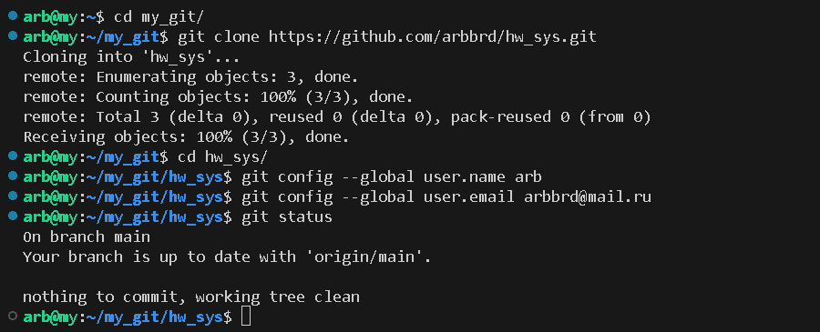
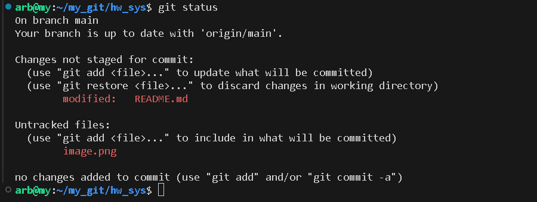
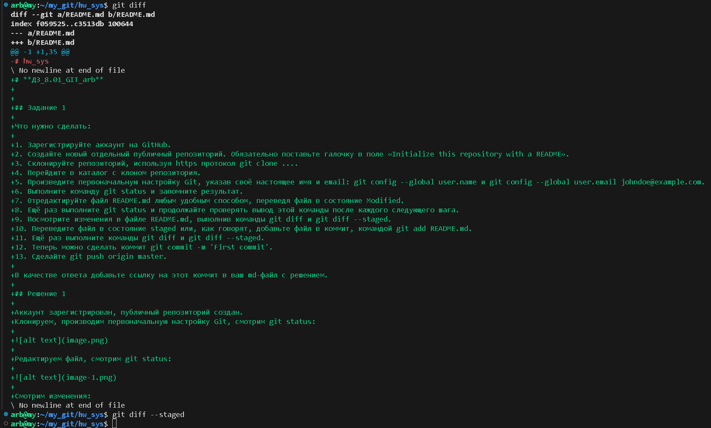
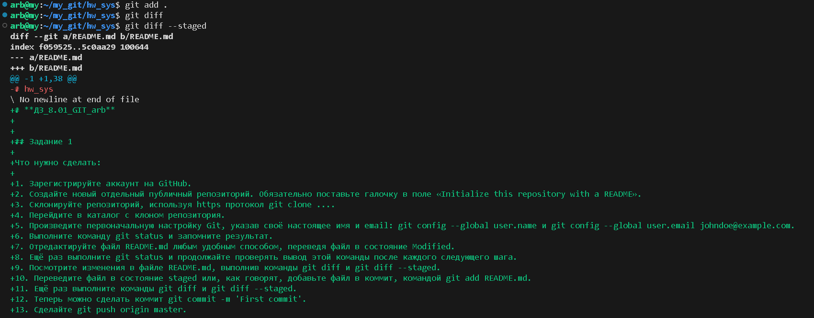
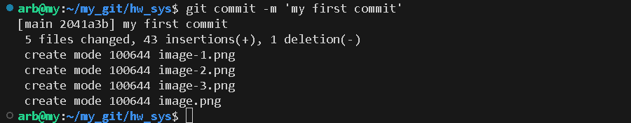
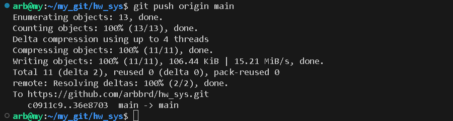
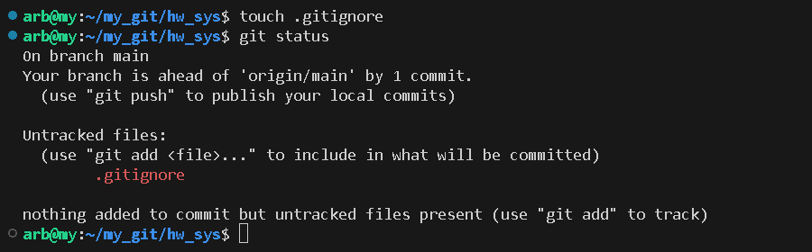
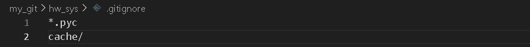

# **ДЗ_8.01_GIT_arb**

## Задание 1

Что нужно сделать:

1. Зарегистрируйте аккаунт на GitHub.
2. Создайте новый отдельный публичный репозиторий. Обязательно поставьте галочку в поле «Initialize this repository with a README».
3. Склонируйте репозиторий, используя https протокол git clone ....
4. Перейдите в каталог с клоном репозитория.
5. Произведите первоначальную настройку Git, указав своё настоящее имя и email: git config --global user.name и git config --global user.email johndoe@example.com.
6. Выполните команду git status и запомните результат.
7. Отредактируйте файл README.md любым удобным способом, переведя файл в состояние Modified.
8. Ещё раз выполните git status и продолжайте проверять вывод этой команды после каждого следующего шага.
9. Посмотрите изменения в файле README.md, выполнив команды git diff и git diff --staged.
10. Переведите файл в состояние staged или, как говорят, добавьте файл в коммит, командой git add README.md.
11. Ещё раз выполните команды git diff и git diff --staged.
12. Теперь можно сделать коммит git commit -m 'First commit'.
13. Сделайте git push origin master.

В качестве ответа добавьте ссылку на этот коммит в ваш md-файл с решением.

## Решение 1

Аккаунт зарегистрирован, публичный репозиторий создан.
Клонируем, производим первоначальную настройку Git, смотрим git status:

Редактируем файл, смотрим git status:

Смотрим изменения, с помощью git diff и git diff --staged:

Добавляем изменения из рабочего каталога в промежуточную область (staging area) перед созданием коммита, смотрим git diff и git diff --staged:

Делаем commit:

Делаем git push:

Ссылка на первый commit:

https://github.com/arbbrd/hw_sys/commit/2041a3bbd8e0dc78ab257440350c70862d91df36

## Задание 2

Что нужно сделать:

1. Создайте файл .gitignore (обратите внимание на точку в начале файла) и проверьте его статус сразу после создания.
2. Добавьте файл .gitignore в следующий коммит git add....
3. Напишите правила в этом файле, чтобы игнорировать любые файлы .pyc, а также все файлы в директории cache.
4. Сделайте коммит и пуш.

В качестве ответа добавьте ссылку на этот коммит в ваш md-файл с решением.

## Решение 2

Создаем, смотрим статус:

Добавляем правила:

Добавляем в индекс, commit и push:

