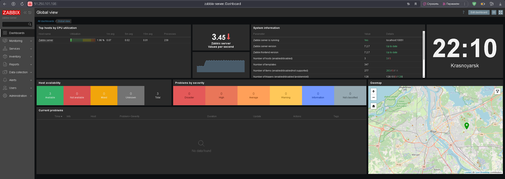
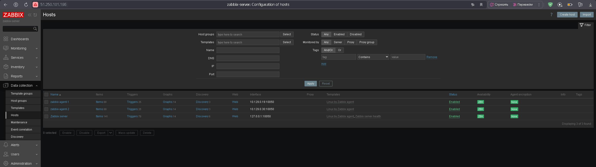
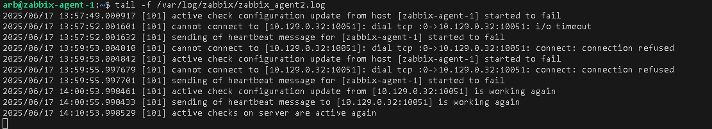
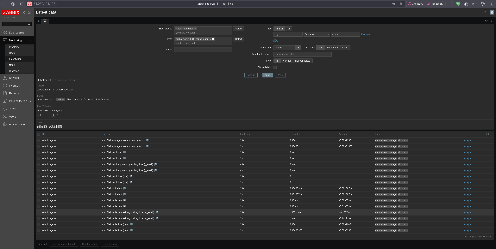

# **hw_02_smon_arb**


## Задание 1

Установить Zabbix Server с вэб-интерфейсом.

Процесс выполнения:

1. Выполняя ДЗ, сверяйтесь с процессом отражённым в записи лекции.
2. Установите PostgreSQL. Для установки достаточна та версия, что есть в системном репозитороии Debian 11.
3. Пользуясь конфигуратором команд с официального сайта, составьте набор команд для установки последней версии Zabbix с поддержкой PostgreSQL и Apache.
4. Выполните все необходимые команды для установки Zabbix Server и Zabbix Web Server.

Требования к результату:

1. Прикрепите в файл README.md скриншот авторизации в админке.
2. Приложите в файл README.md текст использованных команд в GitHub.

## Решение 1

Установлен postgresql:
```
sudo apt install postgresql
```

Устанавливаем Zabbix Server, Frontend, Agent 2 с поддержкой PostgreSQL и Apache
```
# Install Zabbix repository

wget https://repo.zabbix.com/zabbix/7.2/release/ubuntu/pool/main/z/zabbix-release/zabbix-release_latest_7.2+ubuntu24.04_all.deb
sudo dpkg -i zabbix-release_latest_7.2+ubuntu24.04_all.deb
sudo apt update

# Install Zabbix server, frontend, agent2

sudo apt install zabbix-server-pgsql zabbix-frontend-php php8.3-pgsql zabbix-apache-conf zabbix-sql-scripts zabbix-agent2

# Install Zabbix agent 2 plugins

sudo apt install zabbix-agent2-plugin-mongodb zabbix-agent2-plugin-mssql zabbix-agent2-plugin-postgresql

# Create initial database

sudo -u postgres createuser --pwprompt zabbix
sudo -u postgres createdb -O zabbix zabbix

# Import initial schema

zcat /usr/share/zabbix/sql-scripts/postgresql/server.sql.gz | sudo -u zabbix psql zabbix

# Configure the database for Zabbix server

sudo sed -i 's/# DBPassword=/DBPassword=zabbix/g' /etc/zabbix/zabbix_server.conf
```

Проверяем:




## Задание 2

Установить Zabbix Agent на два хоста.

Процесс выполнения:

1. Выполняя ДЗ, сверяйтесь с процессом отражённым в записи лекции.
2. Установите Zabbix Agent на 2 вирт.машины, одной из них может быть ваш Zabbix Server.
3. Добавьте Zabbix Server в список разрешенных серверов ваших Zabbix Agentов.
4. Добавьте Zabbix Agentов в раздел Configuration > Hosts вашего Zabbix Servera.
5. Проверьте, что в разделе Latest Data начали появляться данные с добавленных агентов.

Требования к результату:

1. Приложите в файл README.md скриншот раздела Configuration > Hosts, где видно, что агенты подключены к серверу
2. ППриложите в файл README.md скриншот лога zabbix agent, где видно, что он работает с сервером
3. Приложите в файл README.md скриншот раздела Monitoring > Latest data для обоих хостов, где видны поступающие от агентов данные.
4. Приложите в файл README.md текст использованных команд в GitHub

## Решение 2

Устанавливаем zabbix-agent2:

```
wget https://repo.zabbix.com/zabbix/7.2/release/ubuntu/pool/main/z/zabbix-release/zabbix-release_latest_7.2+ubuntu24.04_all.deb
sudo dpkg -i zabbix-release_latest_7.2+ubuntu24.04_all.deb
sudo apt update 
sudo apt install zabbix-agent2
sudo apt install zabbix-agent2-plugin-mongodb zabbix-agent2-plugin-mssql zabbix-agent2-plugin-postgresql

# Configure zabbix_agent2

sudo nano /etc/zabbix/zabbix_agent2.conf 

# Restart, Enable

sudo systemctl restart zabbix-agent2
sudo systemctl enable zabbix-agent2
```

Добавляем хосты на мониторинг:



Лог zabbix_agent2



Метрики:

