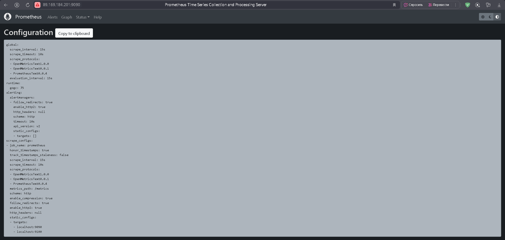

# **hw_04_smon_arb**

## Задание 1

Установить Prometheus.

Процесс выполнения:

1. Выполняя задание, сверяйтесь с процессом, отражённым в записи лекции.
2. Создайте пользователя prometheus.
3. Скачайте prometheus и в соответствии с лекцией разместите файлы в целевые директории.
4. Создайте сервис как показано на уроке.
5. Проверьте что prometheus запускается, останавливается, перезапускается и отображает статус с помощью systemctl.

Требования к результату:

- Прикрепите к файлу README.md скриншот systemctl status prometheus, где будет написано: prometheus.service — Prometheus Service Netology Lesson 9.4 — [Ваши ФИО]

## Решение 1

Создаем пользователя prometheus:
```
sudo useradd --no-create-home --shell /bin/false prometheus
```
Скачиваем и распаковываем:
```
sudo wget https://github.com/prometheus/prometheus/releases/download/v2.53.5/prometheus-2.53.5.linux-amd64.tar.gz
sudo tar xvfz prometheus-2.53.5.linux-amd64.tar.gz 
```
Создаем каталоги:
```
sudo mkdir /etc/prometheus
sudo mkdir /var/lib/prometheus
```
Копируем:
```
sudo cp ./prometheus promtool /usr/local/bin/
sudo cp -R ./console_libraries/ /etc/prometheus/
sudo cp -R ./consoles/ /etc/prometheus/
sudo cp ./prometheus.yml /etc/prometheus/
```
Передаем права пользователю prometheus:
```
sudo chown -R prometheus:prometheus /etc/prometheus/ /var/lib/prometheus/
sudo chown prometheus:prometheus /usr/local/bin/prometheus 
sudo chown prometheus:prometheus /usr/local/bin/promtool 
```
Создаем prometeheus.service:
```
sudo nano /etc/systemd/system/prometeheus.service
```
Со следующим содержимым:
```
[Unit]
Description=Prometheus Service ARB
After=network.target
[Service]
User=prometheus
Group=prometheus
Type=simple
ExecStart=/usr/local/bin/prometheus \
--config.file /etc/prometheus/prometheus.yml \
--storage.tsdb.path /var/lib/prometheus/ \
--web.console.templates=/etc/prometheus/consoles \
--web.console.libraries=/etc/prometheus/console_libraries
ExecReload=/bin/kill -HUP $MAINPID Restart=on-failure
[Install]
WantedBy=multi-user.target
```
Добавляем в автозагрузку, запускаем и смотрим статус:
```
sudo systemctl enable prometeheus.service 
sudo systemctl start prometeheus.service
sudo systemctl status prometeheus.service
```
\

## Задание 2

Установить Node Exporter.

Процесс выполнения:

1. Выполняя задание, сверяйтесь с процессом, отражённым в записи лекции.
2. Скачайте node exporter приведённый в презентации и в соответствии с лекцией разместите файлы в целевые директории.
3. Создайте сервис как показано на уроке.
4. Проверьте что node exporter запускается, останавливается, перезапускается и отображает статус с помощью systemctl.


Требования к результату:

- Прикрепите к файлу README.md скриншот systemctl status node-exporter, где будет написано: node-exporter.service — Node Exporter Netology Lesson 9.4 — [Ваши ФИО]

## Решение 2

Скачиваем и распаковываем:
```
sudo wget https://github.com/prometheus/node_exporter/releases/download/v1.9.1/node_exporter-1.9.1.linux-amd64.tar.gz
sudo tar xvfz node_exporter-1.9.1.linux-amd64.tar.gz 
```
Создаем каталог, копируем, присваеваем права:
```
sudo mkdir /etc/prometheus/node-exporter
sudo cp ./node_exporter /etc/prometheus/node-exporter/
sudo chown prometheus:prometheus /etc/prometheus/node-exporter/node_exporter
```
Создаем node-exporter.service:
```
sudo nano /etc/systemd/system/node-exporter.service
```
СО следующим содержимым:
```
[Unit]
Description=Node Exporter Service ARB
After=network.target
[Service]
User=prometheus
Group=prometheus
Type=simple
ExecStart=/etc/prometheus/node-exporter/node_exporter
[Install]
WantedBy=multi-user.target
```
Добавляем в автозагрузку, запускаем и смотрим статус:
```
sudo systemctl enable node-exporter.service
sudo systemctl start node-exporter.service
sudo systemctl status node-exporter.service
```


## Задание 3

Подключите Node Exporter к серверу Prometheus.

Процесс выполнения:

1. Выполняя задание, сверяйтесь с процессом, отражённым в записи лекции.
2. Отредактируйте prometheus.yaml, добавив в массив таргетов установленный в задании 2 node exporter.
3. Перезапустите prometheus.
4. Проверьте что он запустился.


Требования к результату:

- Прикрепите к файлу README.md скриншот конфигурации из интерфейса Prometheus вкладки Status > Configuration
- Прикрепите к файлу README.md скриншот из интерфейса Prometheus вкладки Status > Targets, чтобы было видно минимум два эндпоинта

## Решение 3

Редактируем prometheus.yml:
```
sudo nano /etc/prometheus/prometheus.yml
```
Содержимое следующее:
```
# my global config
global:
  scrape_interval: 15s # Set the scrape interval to every 15 seconds. Default is every 1 minute.
  evaluation_interval: 15s # Evaluate rules every 15 seconds. The default is every 1 minute.
  # scrape_timeout is set to the global default (10s).

# Alertmanager configuration
alerting:
  alertmanagers:
    - static_configs:
        - targets:
          # - alertmanager:9093

# Load rules once and periodically evaluate them according to the global 'evaluation_interval'.
rule_files:
  # - "first_rules.yml"
  # - "second_rules.yml"

# A scrape configuration containing exactly one endpoint to scrape:
# Here it's Prometheus itself.
scrape_configs:
  # The job name is added as a label `job=<job_name>` to any timeseries scraped from this config.
  - job_name: "prometheus"

    # metrics_path defaults to '/metrics'
    # scheme defaults to 'http'.

    static_configs:
      - targets: ["localhost:9090", "localhost:9100"]
```
Перезапускаем prometheus, смотрим результат:

Status > Configuration



Status > Targets

