# **ДЗ_8.02_Что такое DevOps. СI/СD_arb**


## Задание 1

Что нужно сделать:

1. Установите себе jenkins по инструкции из лекции или любым другим способом из официальной документации. Использовать Docker в этом задании нежелательно.
2. Установите на машину с jenkins golang.
3. Используя свой аккаунт на GitHub, сделайте себе форк репозитория. В этом же репозитории находится дополнительный материал для выполнения ДЗ.
4. Создайте в jenkins Freestyle Project, подключите получившийся репозиторий к нему и произведите запуск тестов и сборку проекта go test . и docker build ..

В качестве ответа пришлите скриншоты с настройками проекта и результатами выполнения сборки.

## Решение 1

Установка jenkins:

```
arb@my:~/my_git/hw_sys/hw_8.02$ sudo wget -O /etc/apt/keyrings/jenkins-keyring.asc https://pkg.jenkins.io/debian/jenkins.io-2023.key
arb@my:~/my_git/hw_sys/hw_8.02$ echo "deb [signed-by=/etc/apt/keyrings/jenkins-keyring.asc]" https://pkg.jenkins.io/debian binary/ | sudo tee  /etc/apt/sources.list.d/jenkins.list > /dev/null
arb@my:~/my_git/hw_sys/hw_8.02$ sudo apt install jenkins
```

Установка java:

```
arb@my:~/my_git/hw_sys/hw_8.02$ sudo apt install default-jre
```

Версия jenkins:

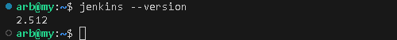

Установка golang:

```
arb@my:~/my_git/hw_sys/hw_8.02$ sudo add-apt-repository ppa:longsleep/golang-backports
arb@my:~/my_git/hw_sys/hw_8.02$ sudo apt install golang-go
```

Версия golang:

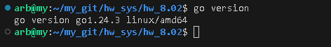

Форк [репозитория](https://github.com/netology-code/sdvps-materials.git) сделан.

Создаем задачу со свободной конфигурацией:

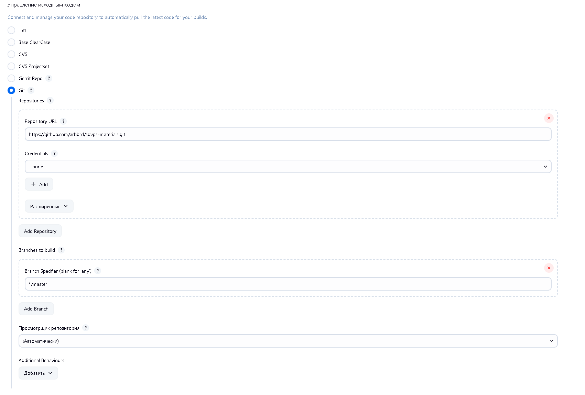

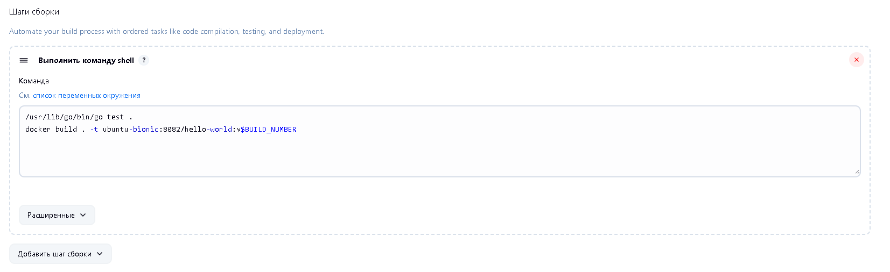

Вывод консоли:

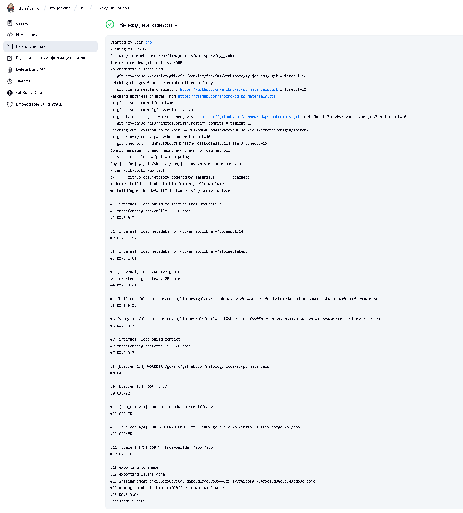


## Задание 2

Что нужно сделать:

1. Создайте новый проект pipeline.
2. Перепишите сборку из задания 1 на declarative в виде кода.

В качестве ответа пришлите скриншоты с настройками проекта и результатами выполнения сборки.

## Решение 2

Создаем pipeline со следующим содержимым:

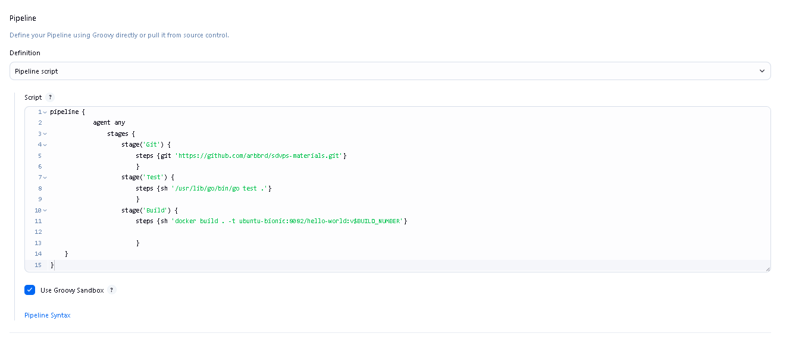

Результат выполнения:

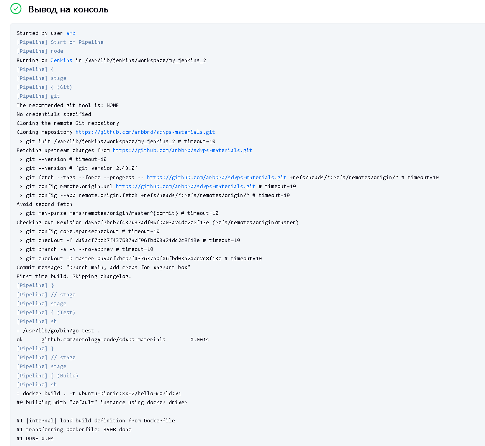
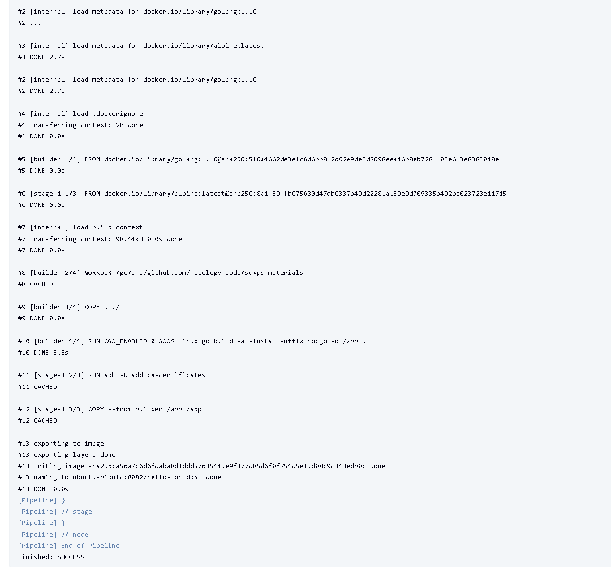


## Задание 3

Что нужно сделать:

1. Установите на машину Nexus.
2. Создайте raw-hosted репозиторий.
3. Измените pipeline так, чтобы вместо Docker-образа собирался бинарный go-файл. Команду можно скопировать из Dockerfile.
4. Загрузите файл в репозиторий с помощью jenkins.

В качестве ответа пришлите скриншоты с настройками проекта и результатами выполнения сборки.

## Решение 3

Установка Nexus:

```
arb@my:~/my_git/hw_sys/hw_8.02$ mkdir nexus-data
arb@my:~/my_git/hw_sys/hw_8.02$ docker run -d -p 8081:8081 --name nexus -v nexus-data:/nexus-data sonatype/nexus3
```

Создан репозиторий:

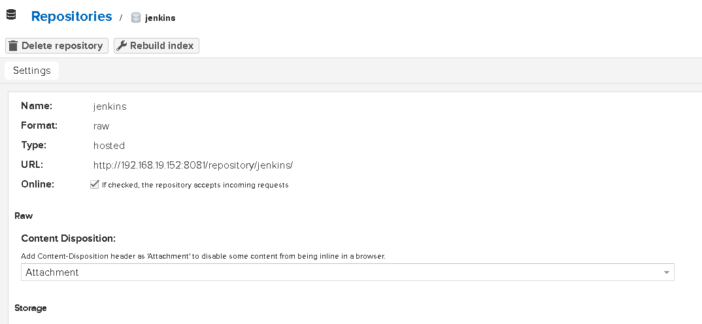

Создаем pipeline со следующим содержимым:

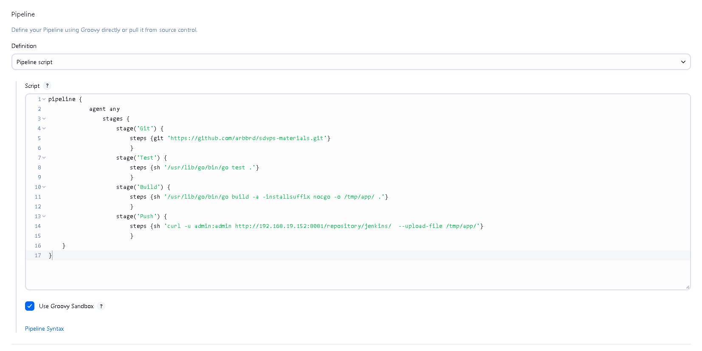

Результат выполнения:

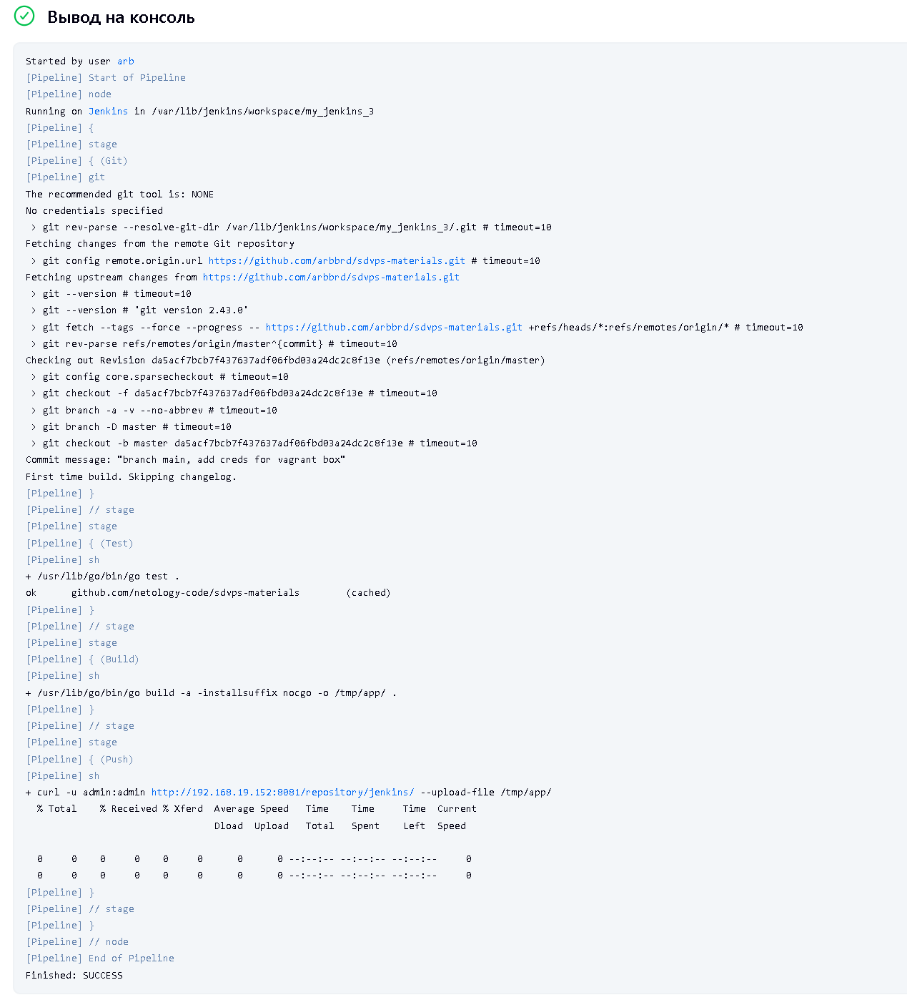

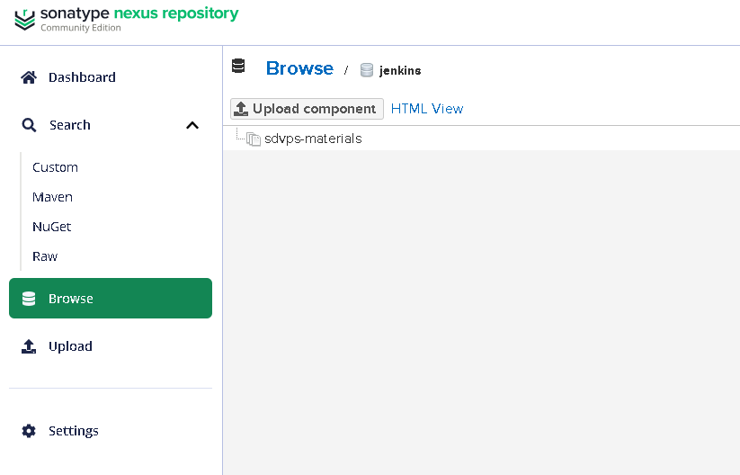

Насчет решения не уверен, почему компилируется файл с именем sdvps-materials? И нет никакого суффикса nocgo? Ну а так проходит без ошибок :frowning;