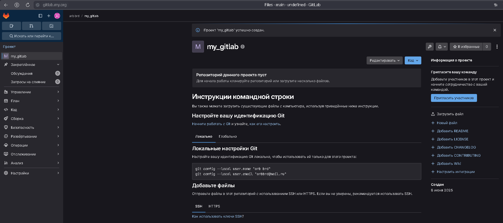

# **ДЗ_8.03_GitLab_arb**


## Задание 1

Что нужно сделать:

1. Разверните GitLab локально, используя Vagrantfile и инструкцию, описанные в этом репозитории.
2. Создайте новый проект и пустой репозиторий в нём.
3. Зарегистрируйте gitlab-runner для этого проекта и запустите его в режиме Docker. Раннер можно регистрировать и запускать на той же виртуальной машине, на которой запущен GitLab.

В качестве ответа в репозиторий шаблона с решением добавьте скриншоты с настройками раннера в проекте.

## Решение 1

Решил разворачивать GitLab на виртуальной машине с Ubuntu в Yandex Cloud:
```
arb@my:~$ curl https://packages.gitlab.com/install/repositories/gitlab/gitlab-ce/script.deb.sh | sudo bash
arb@my:~$ sudo apt install gitlab-ce
```


Меняем external_url на http://gitlab.my.org


Выполняем конфигурирование:
```
arb@my:~$ sudo gitlab-ctl reconfigure
```
Добавляем запись в файл hosts на локальной машине и проверяем:


Регистрируемся, одобряем учетную запись пользователем root.
Создаем новый проект:



Регистрируем gitlab-runner
```
arb@my:~$ docker run -ti --rm --name gitlab-runner  --network host  -v /srv/gitlab-runner/config:/etc/gitlab-runner  -v /var/run/docker.sock:/var/run/docker.sock   gitlab/gitlab-runner:latest register
```


Редактируем /srv/gitlab-runner/config/config.toml


Запускаем gitlab-runner
```
arb@my:~$ docker run -d --name gitlab-runner --restart always  --network host  -v /srv/gitlab-runner/config:/etc/gitlab-runner  -v /var/run/docker.sock:/var/run/docker.sock  gitlab/gitlab-runner:latest
```


Проверяем:


## Задание 2

Что нужно сделать:

1. Запушьте репозиторий на GitLab, изменив origin. Это изучалось на занятии по Git.
2. Создайте .gitlab-ci.yml, описав в нём все необходимые, на ваш взгляд, этапы.

В качестве ответа в шаблон с решением добавьте:

- файл gitlab-ci.yml для своего проекта или вставьте код в соответствующее поле в шаблоне;
- скриншоты с успешно собранными сборками.

## Решение 2

Клонирую себе, меняю url:
```
arb@my:~/my_git/sdvps$ git remote set-url origin http://gitlab.my.org/arb/my_gitlab.git
```


Пушим в GitLab:


Создаем .gitlab-ci.yml со следующим содержимым:


Комитим, пушим и смотрим:


