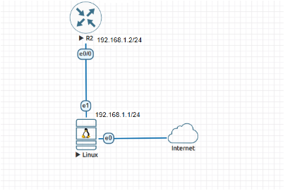
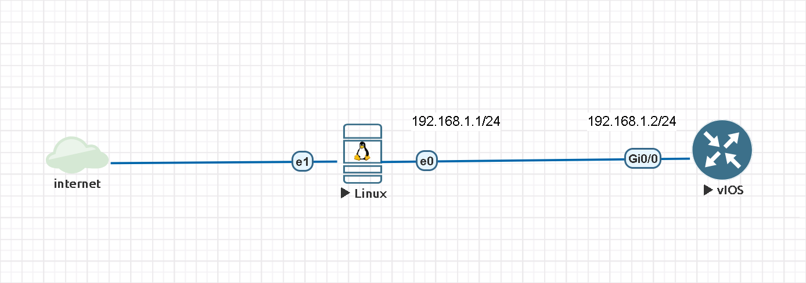
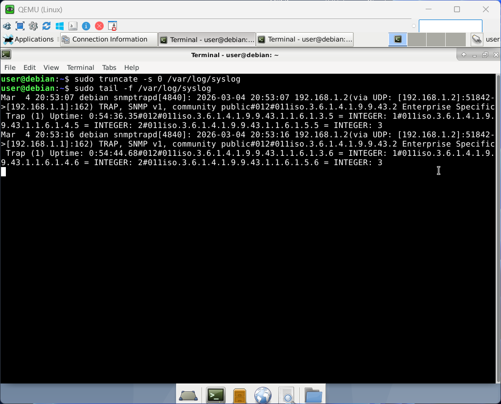
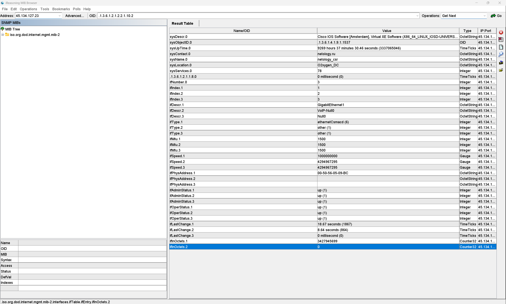

# **optnt_arb**

Для выполнения домашнего задания необходимо собрать стенд в EVE-NG:

1. установленный сервер Linux (Debian) с подключением к сети Интернет (тип сети – Management Cloud0)
2. маршрутизатор

Подключить оборудование, как показано на схеме:



## Задание 1. Настройка SNMP Trap

1. Установите образ ноды Linux в EVE-NG:

- Скачайте образ Debian по ссылке.
- Скопируйте образ в eve-ng с помощью winscp или аналогичной программы в папку /opt/unetlab/addons/qemu/
- Распакуйте образ с помощью команды tar xzvf /opt/unetlab/addons/qemu/linux-debian-10.tar.gz && rm /opt/unetlab/addons/qemu/linux-debian-10.tar.gz
- Выполните команду /opt/unetlab/wrappers/unl_wrapper -a fixpermissions

2. Создать новую лабораторную с нодами:

- Добавьте в лабораторную ноду Linux с 2 сетевыми картами, а также 1 маршрутизатор (Cisco IOL L3)
- Добавьте сеть типа Management Cloud0 с названием Internet. Подключите эту сеть к первому интерфейсу Linux Debian
- Подключите второй интерфейс Linux Debian к маршрутизатору

3. Установите демон snmp на сервер Linux Debian:

- Подключитесь к серверу Linux Debian (логин по умолчанию user, пароль Test123), откройте терминал. Проверьте, как называется первый интерфейс (к которому подключена сеть Интернет) в Linux Debian при помощи команды ip a
- Выполните команду sudo dhclient <первый_интерфейс> для получения доступа в Интернет через первый интерфейс (например, dhclient ens3)
- Выполните команды для обновления репозиториев:
```
sudo sed -i ‘s/deb.debian.org/archive.debian.org/’ /etc/apt/sources.list
sudo sed -i ‘s/security.debian.org/archive.debian.org/’ /etc/apt/sources.list
```
- Установите netflow-коллектор:
```
sudo apt update && apt install snmp snmpd snmptrapd
```
Проверьте, как называется второй интерфейс (к которому подключена сеть Bridge) при помощи команды nmcli connection show
Установите локальный IP-адрес для Debian Linux для второго интерфейса при помощи команды nmcli connection modify “Wired connection 1” ipv4.method “manual” “ipv4.addresses “192.168.1.1/24”

Откройте конфигурационный файл snmptrapd:
```
sudo nano /etc/snmp/snmptrapd.conf
```
Включите прием сообщений с community public, добавив строку:
```
authCommunity log public
```
И перезапустите службу:
```
sudo systemctl restart snmptrapd
```
Настройте отправку snmp trap с маршрутизатора на Linux:
```
snmp-server community public
snmp-server enable traps auth-framework sec-violation auth-fail
snmp-server enable traps config-copy
snmp-server enable traps config
snmp-server host 192.168.1.1 public
```
Сгенерируйте отправку события snmptrap, отключившись от терминала на маршрутизаторе
```
configure terminal
exit
```
Убедитесь, что snmptrap виден в Linux:
```
tail -f /var/log/syslog
```

Пришлите скриншот вывода команды tail -f /var/log/syslog, где будет виден snmptrap от маршрутизатора.

## Решение 1.

Схема собрана и настроена в EVE-NG:



Результат:




## Задание 2. Работа с SNMP Walk

С помощью snmpwalk запросите все доступные данные у хоста:

IP: 45.134.127.23
SNMP-community: netology_snmp

## Решение 2.

Использовался iReasoning MIB Browser

