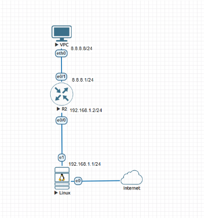
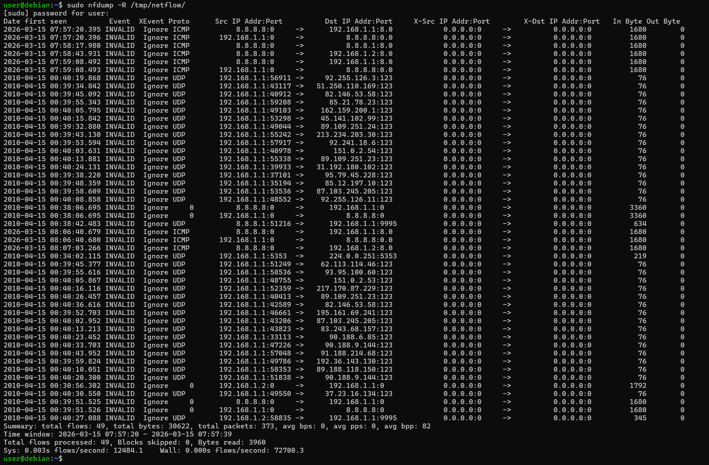
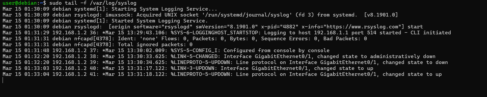

# **optnt_arb**

Для выполнения домашнего задания необходимо собрать стенд в EVE-NG:

1. установленный сервер Linux (Debian) с подключением к сети Интернет (тип сети – Management Cloud0)
2. маршрутизатор
3. хост Virtual PC

Подключить оборудование, как показано на схеме:



## Задание 1. Настройка NetFlow и сбор статистики трафика

1. Установить Netflow-коллектор на сервер Linux Debian.

    - Создать директорию netflow: 
        ```
        mkdir -p /tmp/netflow
        ```
    - Установить netflow-коллектор: 
        ```
        sudo apt update && apt install softflowd nfdump -y
        ```
    - Запустить netflow коллектор:
        ```
        sudo softflowd -i ens4 -n 127.0.0.1:9995 -v 9 (где ens4 - интерфейс с IP 192.168.1.1/24)
        sudo nfcapd -w -l /tmp/netflow -p 9995&
        ```
    - Настроить отправку netflow на 192.168.1.1 (порт UDP/9995). В отправку нужно включить:

        Source/Destination IP
        Source/Destination Port
        ToS byte, tcp flags
        next-hop
        Timestamp

    - Отправить тестовый трафик на netflow (отправив пакеты) и проверьте, что данные видны:
        ```
        sudo nfdump -R /tmp/netflow/
        ```
    Приложить скриншот вывода команды sudo nfdump -R /tmp/netflow/, где будет видны netflow данные.

## Решение 1.

Настройки маршрутизатора

```
no ipv6 cef
flow record MY
 match ipv4 source address
 match ipv4 destination address
 match ipv4 protocol
 match transport source-port
 match transport destination-port
 match ipv4 tos
 collect routing next-hop address ipv4
 collect timestamp sys-uptime first
 collect timestamp sys-uptime last
 collect transport tcp flags
 collect counter bytes long
 collect counter packets long
flow exporter MY
 destination 192.168.1.1
 source GigabitEthernet0/0
 transport udp 9995
flow monitor MY
 exporter MY
 record MY
multilink bundle-name authenticated
redundancy
interface GigabitEthernet0/0
 ip address 192.168.1.2 255.255.255.0
 duplex auto
 speed auto
 media-type rj45
interface GigabitEthernet0/1
 ip address 8.8.8.1 255.255.255.0
 ip flow monitor MY input
 ip flow monitor MY output
 duplex auto
 speed auto
 media-type rj45
```

Вывод команды sudo nfdump -R /tmp/netflow/:




## Задание 2. Анализ NetFlow статистики

На основе данных из задания 1 (команды sudo nfdump -R /tmp/netflow/) проанализируйте NetFlow статистику и определите:

- Источник с наибольшим объёмом отправленного трафика
- Назначение с наибольшим объёмом полученного трафика
- Общее количество потоков (flows)

## Решение 2.

На основе предоставленного вывода команды nfdump -R /tmp/netflow/, анализ NetFlow статистики показывает следующие результаты:

- Источник с наибольшим объёмом отправленного трафика: IP-адрес 192.168.1.1. Этот узел является отправителем в большинстве записей, включая крупные пакеты по 3360 и 1680 байт, а также многочисленные UDP-запросы.
- Назначение с наибольшим объёмом полученного трафика: IP-адрес 192.168.1.1. В данной выборке он выступает основным получателем входящего трафика от внешних ресурсов (например, от 8.8.8.8 
и 192.168.1.2).
- Общее количество потоков (flows): 49. Это значение указано в итоговой строке Summary (Summary: total flows: 49).


## Задание 3. Настройка Syslog и сбор системных логов

В файле /etc/rsyslog.conf раскомментировать строки:
- module(load=“imudp”)
- input(type=“imudp” port=“514”)

И перезапустить rsyslog:
- sudo systemctl restart rsyslog

Настройте отправку логов с маршрутизатора на Linux-сервер.
Сгенерируйте несколько событий (например, включите/отключите интерфейс).
Проверьте, что событие попало в syslog-сервер командой: tail -f /var/log/syslog

## Решение 3.

