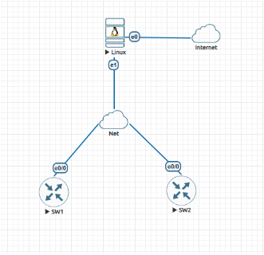
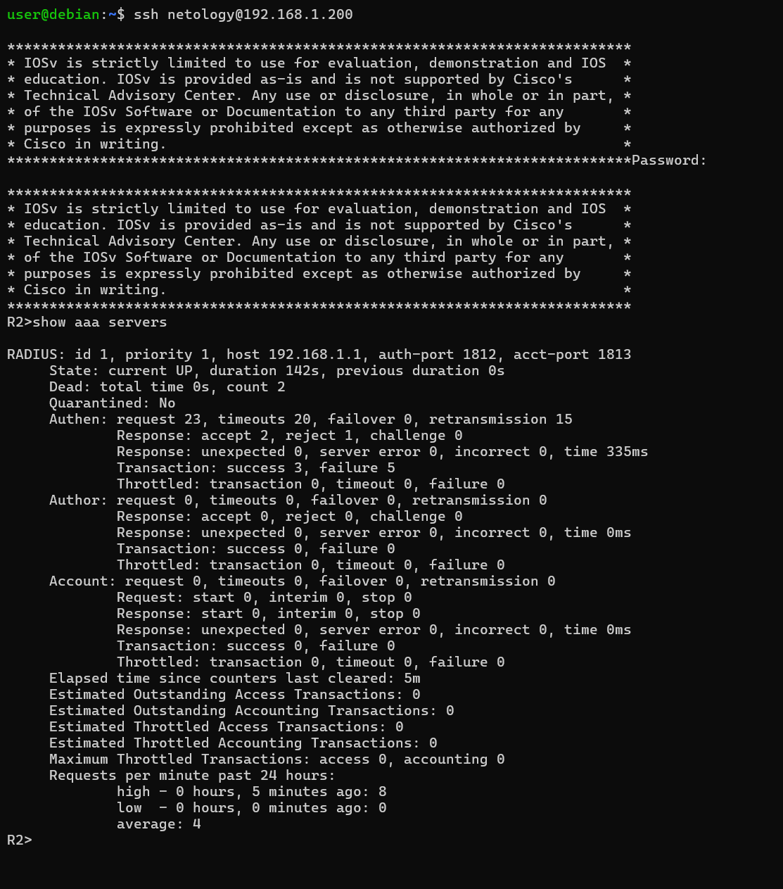

# **optnt_arb**

Для выполнения домашнего задания необходимо собрать стенд в EVE-NG:

1. установленный сервер Linux (Debian) с подключением к сети Интернет (тип сети – Management Cloud0)
2. 2 коммутатора
3. подключить сервер и коммутаторы друг к другу с помощью сети типа Bridge

Подключить оборудование, как показано на схеме:



## Задание 1. Настройка RADIUS-сервера и AAA на сетевом оборудовании

1. Установить Freeradius на сервер Linux Debian
2. Добавить клиентов в Freeradius, внеся изменения в /etc/freeradius/3.0/clients.conf :
    ```
    client sw1 {
    ipaddr = 192.168.1.100
    secret = 123key
    }
    client sw2 {
    ipaddr = 192.168.1.200
    secret = 123key
    }
    ```
3. Добавить пользовательскую учётную запись, внеся изменения в /etc/freeradius/3.0/mods-config/files/authorize :
    ```
    netology Cleartext-Password := "netology"
    Service-Type = NAS-Prompt-User,
    Cisco-AVPair = "shell:priv-lvl=15"
    ```
4. Сгенерировать ssh-ключи на коммутаторах для включения доступа по SSH и настроить конфигурации freeradius IP-адреса (192.168.1.100 и 192.168.1.200 соответственно).
5. Настроить доступ к коммутатору по аутентификации через radius. Основной доступ через RADIUS, резервный через локальную базу данных (УЗ с максимальными правами).

Результатом будет скриншот с успешным подключением к коммутатору через RADIUS, а также скриншот вывода команды show aaa servers с коммутатора.

## Решение 1.

Freeradius установлен и настроен по инструкции.
Приведу пример настройки одного из коммутаторов, второй настроен аналогично:
```
R2(config)#ip domain-name my.org
R2(config)#crypto key generate rsa general-keys modulus 2048
R2(config)#ip ssh version 2
R2(config)#username arb privilege 15 secret arb
R2(config)#aaa new-model
R2(config)#aaa authentication login default group radius local
R2(config)#radius server MY
R2(config-radius-server)#$4 192.168.1.1 auth-port 1812 acct-port 1813
R2(config-radius-server)#key 123key
R2(config)#line vty 0 4
R2(config-line)#login authentication default
R2(config-line)#transport input ssh
```
Результат:




## Задание 2. Анализ безопасности

Безопасно ли данное подключение к оборудованию? Если нет, почему? Что можно сделать, чтобы обезопасить доступ к оборудованию через RADIUS?

## Решение 2.

Подключение небезопасно из‑за следующих уязвимостей:

1. Передача данных по UDP без шифрования — пароли могут быть перехвачены.
2. Уязвимость Blast‑RADIUS (CVE‑2024‑3596) — возможна подделка ответа сервера.
3. Простой общий секрет (123key) — легко подобрать или перехватить.
4. Однофакторная аутентификация (только пароль) — при компрометации учётных данных злоумышленник получает полный доступ.
5. Отсутствие защиты самого RADIUS‑сервера — нет брандмауэра, ограничений по IP и т. д.

Как обезопасить подключение:

1. Перейти на RADIUS over TLS (RadSec) — шифрование трафика.
2. Использовать Message‑Authenticator (если переход на TLS невозможен) — защита целостности сообщений.
3. Внедрить многофакторную аутентификацию (MFA) — добавить второй фактор (OTP, смарт‑карты и т. п.).
4. Настроить брандмауэр — разрешить доступ к RADIUS‑серверу только с доверенных IP.
5. Включить детальное логирование — отслеживать попытки аутентификации и аномалии.
6. Синхронизировать время (NTP) — для корректной работы механизмов аутентификации.
7. Регулярно обновлять ПО и делать резервные копии конфигурации.
8. Применить принцип наименьших привилегий — ограничить права пользователей.
9. Проводить регулярные аудиты безопасности — проверять конфигурацию на уязвимости.
10. Изолировать трафик RADIUS через VLAN или туннелирование (TLS/IPsec).