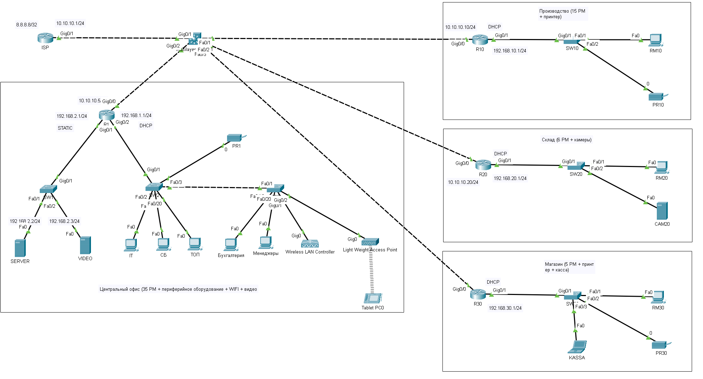

# **crpnt_8_1_arb**

## Лабораторная работа "Построение корпоративной сети"

Руководство организации, в которой вы работаете сообщило вам, что компания расширяется. В следующем месяце в планах открыть новые офисы в соседнем регионе.

Перед вами поставили следующие требования:

1. Будут 4 офиса: 1 центральный и 3 отдаленных мини-офиса.
2. В центральном офисе планируется разместить 35 сотрудников из следующих отделов:
    - ТОП-менеджеры
    - менеджеры по продажам
    - IT-отдел
    - служба безопасности
    - бухгалтерия
3. В центральном офисе помимо рабочих станций будут: принтеры, устройства для подключения к сети Wi-Fi, камеры видеонаблюдения.
4. В остальных мини-офисах планируется разместить:
    - в первом: производственный цех с 15 сотрудниками, их рабочие станции и принтер
    - во втором: склад с 6 сотрудниками, их рабочие станции и камеры видеонаблюдения
    - в третьем: магазин по продаже изготовленной продукции с 5 сотрудниками, их рабочие станции, принтер и кассовое устройство
5. При проектировании сети в Packet Tracer не требуется подключение всех оконечных устройств
6. Сотрудники всех мини-офисов должны иметь доступ к инфраструктуре центрального офиса.
7. IPv6 адресация в работе не рассматривается.

В Cisco Packet Tracer необходимо спроектировать и настроить сеть согласно условиям задания. Составить адресный план. Число и функционал коммутаторов доступа вы определяете самостоятельно.

Отправьте pkt-файл и приложите краткое описание используемых решений.

## Решение

Для данной работы уровни ядра и распределения объединены.        
Для экономии времени не сделано распределение по VLAN. В реальности данное распределение необходимо сделать.        
Транспортная сеть 10.10.10.0/24, динамическая маршрутизация RIP      

Центральный офис.

Коммутаторы SW2 и SW3 считаем стеком.    
Сеть 192.168.2.0 развернута для КИИ (адреса статические)   
Сеть 192.168.1.0 развернута для сотрудников, принтера, WIFI. Адреса раздаются по DHCP, настроенного на R1.    

Филиалы.    

Настроены одинаково, адреса раздаются по DHCP.      
На Производстве сеть 192.168.10.0/24      
На Складе сеть 192.168.20.0/24       
В Магазине сеть 192.168.30.0/24      

Схема сети:

pkt-файл:

