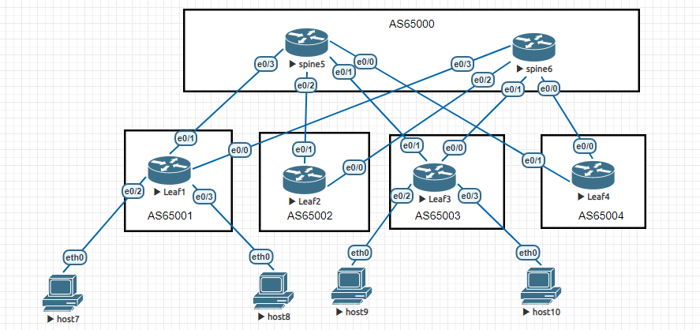
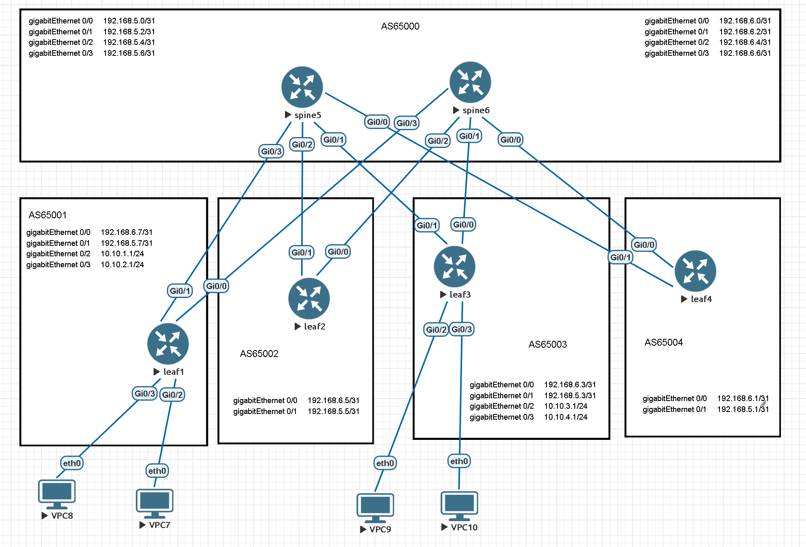
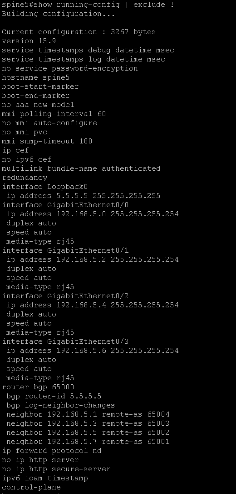
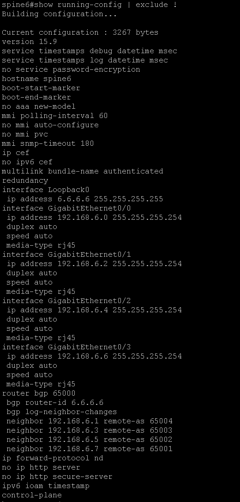
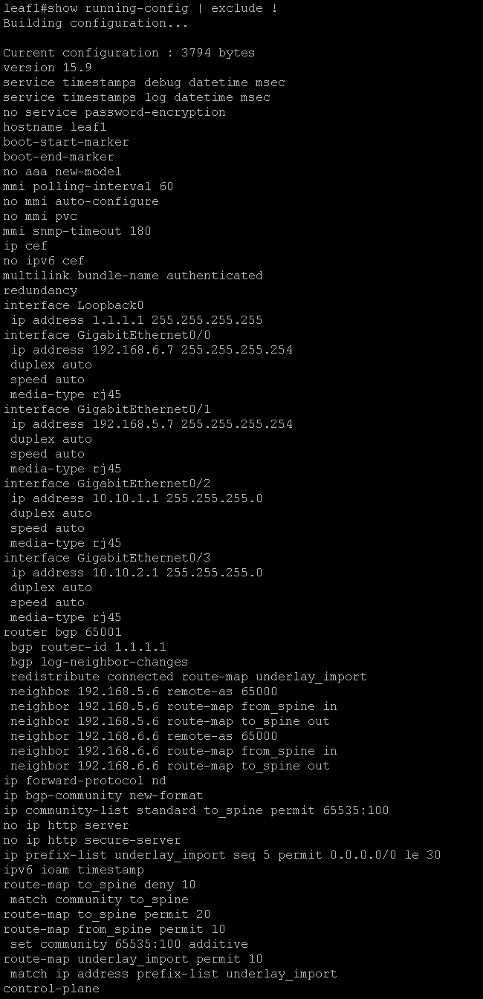
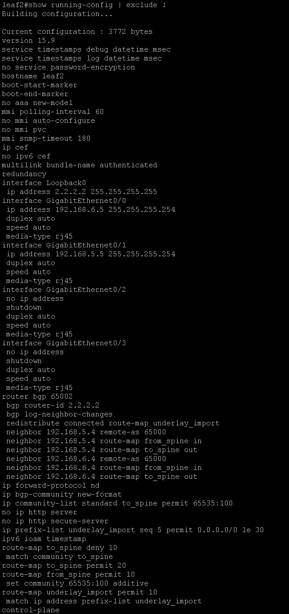
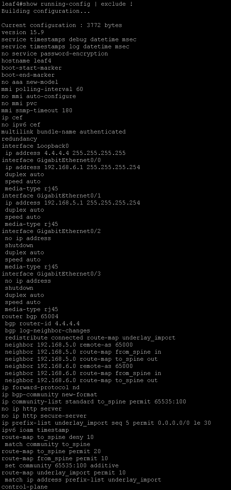

# **crpnt_8_2_arb**

## Лабораторная работа "Построение сетей Дата Центра"



Для указанной топологии необходимо настроить маршрутизацию eBGP для underlay сети DC.

Номера AS используйте из топологии. Адресацию стыковочных линков и импортируемых сетей выберите на свое усмотрение.
!!! Важно, чтобы в сети были доступны по BGP 2 разных маршрута до каждой клиентской сети через разные spine.
Количество подключенных конечных хостов можно не соблюдать, достаточно двух.

Отправьте полный список конфигураций: каждого leaf и spine маршрутизаторов.

## Решение

Собрал схему в EVE-NG:



Команды настройки и конфигурация маршрутизаторов:

### spine5

```
Router(config)#hostname spine5

spine5(config)#interface loopback 0
spine5(config-if)#ip address 5.5.5.5 255.255.255.255

spine5(config)#interface gigabitEthernet 0/0
spine5(config-if)#ip address 192.168.5.0 255.255.255.254
spine5(config-if)#no shutdown

spine5(config)#interface gigabitEthernet 0/1
spine5(config-if)#ip address 192.168.5.2 255.255.255.254
spine5(config-if)#no shutdown

spine5(config)#interface gigabitEthernet 0/2
spine5(config-if)#ip address 192.168.5.4 255.255.255.254
spine5(config-if)#no shutdown

spine5(config)#interface gigabitEthernet 0/3
spine5(config-if)#ip address 192.168.5.6 255.255.255.254
spine5(config-if)#no shutdown

spine5(config)#router bgp 65000
spine5(config-router)#bgp router-id 5.5.5.5
spine5(config-router)#neighbor 192.168.5.1 remote-as 65004
spine5(config-router)#neighbor 192.168.5.3 remote-as 65003
spine5(config-router)#neighbor 192.168.5.5 remote-as 65002
spine5(config-router)#neighbor 192.168.5.7 remote-as 65001
```

Конфигурация spine5




### spine6

```
Router(config)#hostname spine6

spine6(config)#interface loopback 0
spine6(config-if)#ip address 6.6.6.6 255.255.255.255
s
spine6(config)#interface gigabitEthernet 0/0
spine6(config-if)#ip address 192.168.6.0 255.255.255.254
spine6(config-if)#no shutdown

spine6(config)#interface gigabitEthernet 0/1
spine6(config-if)#ip address 192.168.6.2 255.255.255.254
spine6(config-if)#no shutdown

spine6(config)#interface gigabitEthernet 0/2
spine6(config-if)#ip address 192.168.6.4 255.255.255.254
spine6(config-if)#no shutdown
s
spine6(config)#interface gigabitEthernet 0/3
spine6(config-if)#ip address 192.168.6.6 255.255.255.254
spine6(config-if)#no shutdown

spine6(config)#router bgp 65000
spine6(config-router)#bgp router-id 6.6.6.6
spine6(config-router)#neighbor 192.168.6.1 remote-as 65004
spine6(config-router)#neighbor 192.168.6.3 remote-as 65003
spine6(config-router)#neighbor 192.168.6.5 remote-as 65002
spine6(config-router)#neighbor 192.168.6.7 remote-as 65001
```

Конфигурация spine5



### leaf1

```
Router(config)#hostname leaf1

leaf1(config)#interface loopback 0
leaf1(config-if)#ip address 1.1.1.1 255.255.255.255

leaf1(config)#interface gigabitEthernet 0/0
leaf1(config-if)#ip address 192.168.6.7 255.255.255.254
leaf1(config-if)#no shutdown

leaf1(config)#interface gigabitEthernet 0/1
leaf1(config-if)#ip address 192.168.5.7 255.255.255.254
leaf1(config-if)#no shutdown

leaf1(config)#interface gigabitEthernet 0/2
leaf1(config-if)#ip address 10.10.1.1 255.255.255.0
leaf1(config-if)#no shutdown

leaf1(config)#interface gigabitEthernet 0/3
leaf1(config-if)#ip address 10.10.2.1 255.255.255.0
leaf1(config-if)#no shutdown

leaf1(config)#ip prefix-list underlay_import permit 0.0.0.0/0 le 30
leaf1(config)#route-map underlay_import
leaf1(config-route-map)#match ip address prefix-list underlay_import

leaf1(config)#route-map from_spine
leaf1(config-route-map)#set community 65535:100 additive

leaf1(config)#route-map to_spine deny 10
leaf1(config-route-map)#match community to_spine
leaf1(config-route-map)#route-map to_spine permit 20

leaf1(config)#ip bgp-community new-format
leaf1(config)#ip community-list standard to_spine permit 65535:100

leaf1(config)#router bgp 65001
leaf1(config-router)#bgp router-id 1.1.1.1
leaf1(config-router)#redistribute connected route-map underlay_import

leaf1(config-router)#neighbor 192.168.5.6 remote-as 65000
leaf1(config-router)#neighbor 192.168.5.6 route-map from_spine in
leaf1(config-router)#neighbor 192.168.5.6 route-map to_spine out

leaf1(config-router)#neighbor 192.168.6.6 remote-as 65000
leaf1(config-router)#neighbor 192.168.6.6 route-map from_spine in
leaf1(config-router)#neighbor 192.168.6.6 route-map to_spine out
```

Конфигурация leaf1



### leaf2

```
Router(config)#hostname leaf2
l
leaf2(config)#interface loopback 0
leaf2(config-if)#ip address 2.2.2.2 255.255.255.255

leaf2(config)#interface gigabitEthernet 0/0
leaf2(config-if)#ip address 192.168.6.5 255.255.255.254
leaf2(config-if)#no shutdown

leaf2(config)#interface gigabitEthernet 0/1
leaf2(config-if)#ip address 192.168.5.5 255.255.255.254
leaf2(config-if)#no shutdown

leaf2(config)#ip prefix-list underlay_import permit 0.0.0.0/0 le 30
leaf2(config)#route-map underlay_import
leaf2(config-route-map)#match ip address prefix-list underlay_import

leaf2(config)#route-map from_spine
leaf2(config-route-map)#set community 65535:100 additive

leaf2(config)#route-map to_spine deny 10
leaf2(config-route-map)#match community to_spine
leaf2(config-route-map)#route-map to_spine permit 20

leaf2(config)#ip bgp-community new-format
leaf2(config)#ip community-list standard to_spine permit 65535:100

leaf2(config)#router bgp 65002
leaf2(config-router)#bgp router-id 2.2.2.2
leaf2(config-router)#redistribute connected route-map underlay_import

leaf2(config-router)#neighbor 192.168.5.4 remote-as 65000
leaf2(config-router)#neighbor 192.168.5.4 route-map from_spine in
leaf2(config-router)#neighbor 192.168.5.4 route-map to_spine out

leaf2(config-router)#neighbor 192.168.6.4 remote-as 65000
leaf2(config-router)#neighbor 192.168.6.4 route-map to_spine out
leaf2(config-router)#neighbor 192.168.6.4 route-map from_spine in
```

Конфигурация leaf2



### leaf3

```
Router(config)#hostname leaf3

leaf3(config)#interface loopback 0
leaf3(config-if)#ip address 3.3.3.3 255.255.255.255
l
leaf3(config)#interface gigabitEthernet 0/0
leaf3(config-if)#ip address 192.168.6.3 255.255.255.254
leaf3(config-if)#no shutdown

leaf3(config)#interface gigabitEthernet 0/1
leaf3(config-if)#ip address 192.168.5.3 255.255.255.254
leaf3(config-if)#no shutdown

leaf3(config)#interface gigabitEthernet 0/2
leaf3(config-if)#ip address 10.10.3.1 255.255.255.0
leaf3(config-if)#no shutdown

leaf3(config)#interface gigabitEthernet 0/3
leaf3(config-if)#ip address 10.10.4.1 255.255.255.0
leaf3(config-if)#no shutdown

leaf3(config)#ip prefix-list underlay_import permit 0.0.0.0/0 le 30
leaf3(config)#route-map underlay_import
leaf3(config-route-map)#match ip address prefix-list underlay_import

leaf3(config)#route-map from_spine
leaf3(config-route-map)#set community 65535:100 additive

leaf3(config)#route-map to_spine deny 10
leaf3(config-route-map)#match community to_spine
leaf3(config-route-map)#route-map to_spine permit 20

leaf3(config)#ip bgp-community new-format
leaf3(config)#ip community-list standard to_spine permit 65535:100
leaf3(config)#router bgp 65003
leaf3(config-router)#bgp router-id 3.3.3.3
leaf3(config-router)#redistribute connected route-map underlay_import
l
leaf3(config-router)#neighbor 192.168.5.2 remote-as 65000
leaf3(config-router)#neighbor 192.168.5.2 route-map from_spine in
leaf3(config-router)#neighbor 192.168.5.2 route-map to_spine out

leaf3(config-router)#neighbor 192.168.6.2 remote-as 65000
leaf3(config-router)#neighbor 192.168.6.2 route-map from_spine in
leaf3(config-router)#neighbor 192.168.6.2 route-map to_spine out
```

Конфигурация leaf3


### leaf 4

```
Router(config)#hostname leaf4

leaf4(config)#interface loopback 0
leaf4(config-if)#ip address 4.4.4.4 255.255.255.255
l
leaf4(config)#interface gigabitEthernet 0/0
leaf4(config-if)#ip address 192.168.6.1 255.255.255.254
leaf4(config-if)#no shutdown

leaf4(config)#interface gigabitEthernet 0/1
leaf4(config-if)#ip address 192.168.5.1 255.255.255.254
leaf4(config-if)#no shutdown

leaf4(config)#ip prefix-list underlay_import permit 0.0.0.0/0 le 30
leaf4(config)#route-map underlay_import
leaf4(config-route-map)#match ip address prefix-list underlay_import

leaf4(config)#route-map from_spine
leaf4(config-route-map)#set community 65535:100 additive

leaf4(config)#route-map to_spine deny 10
leaf4(config-route-map)#match community to_spine
leaf4(config-route-map)#route-map to_spine permit 20

leaf4(config)#ip bgp-community new-format
leaf4(config)#ip community-list standard to_spine permit 65535:100
leaf4(config)#router bgp 65004
leaf4(config-router)#bgp router-id 4.4.4.4
leaf4(config-router)#redistribute connected route-map underlay_import

leaf4(config-router)#neighbor 192.168.5.0 remote-as 65000
leaf4(config-router)#neighbor 192.168.5.0 route-map from_spine in
leaf4(config-router)#neighbor 192.168.5.0 route-map to_spine out

leaf4(config-router)#neighbor 192.168.6.0 remote-as 65000
leaf4(config-router)#neighbor 192.168.6.0 route-map from_spine in
leaf4(config-router)#neighbor 192.168.6.0 route-map to_spine out
```

Конфигурация leaf4

