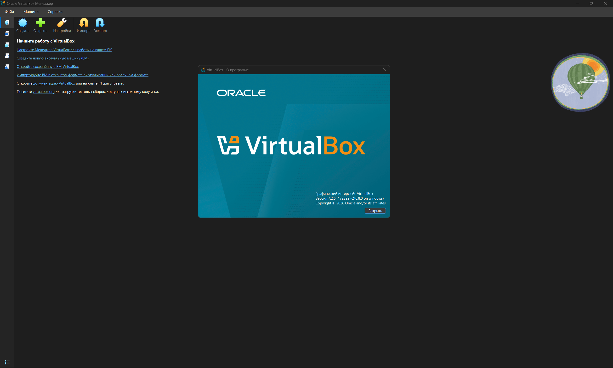
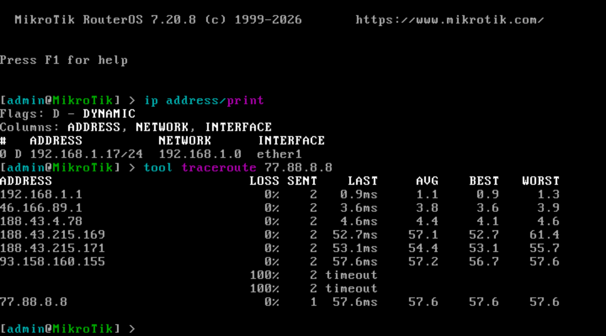
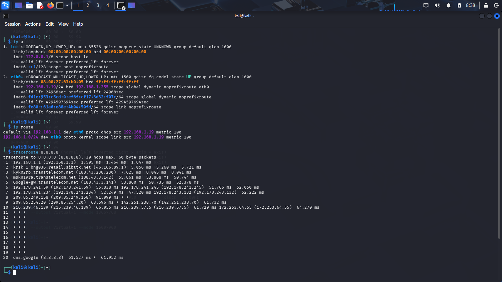
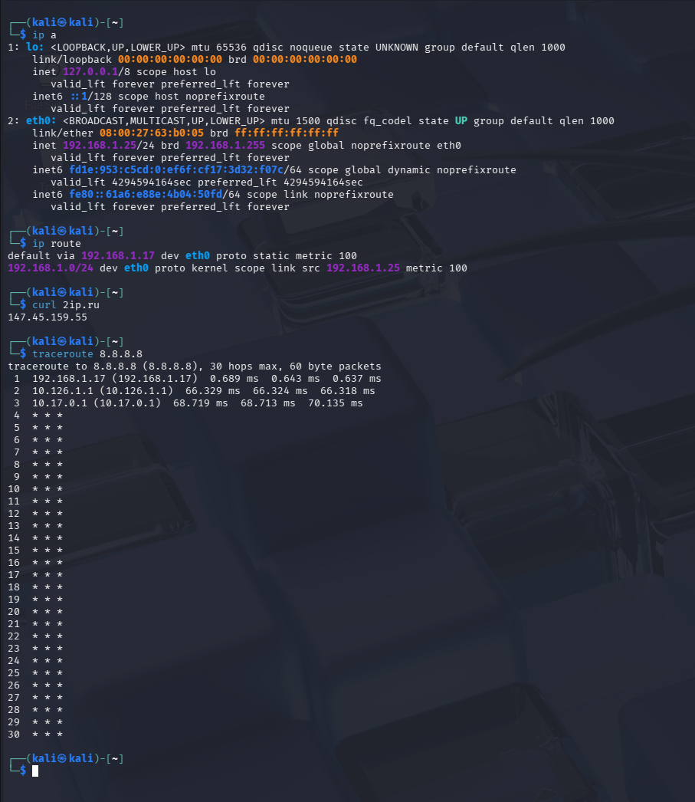

# **crpnt_8_4_arb**

## Лабораторная работа "Виртуализация сетевых функций"

## Задание 1.

Выполнить установку VirtualBox на хост машину с ОС Windows.

## Решение 1.

Установлен.

## Задание 2.

Выполнить установку и запуск ВМ Mikrotik CHR в VirtualBox.

## Решение 2.

Вывод ip address print и tool traceroute 77.88.8.8 (до гугла больше хопов, в один скриншот не входит 😉)

## Задание 3.

Выполнить установку и запуск ВМ Kali Linux в VirtualBox.

## Решение 3.

Kali Linux установлен и настроен. Вывод ip a, ip route, traceroute 8.8.8.8

## Задание 4.

Выполнить перенаправление трафика с ВМ Kali Linux в ранее запущенный виртуальный маршрутизатор.

## Решение 4.

Предварительно выполнен импорт netology-84-6.49.17-v4.backup на виртуальном маршрутизаторе.     
В настройках сетевого интерфейса в качестве шлюза по умолчанию указан IP виртуального машрутизатора.      
Вывод ip a, ip route, curl 2ip.ru, traceroute 8.8.8.8

