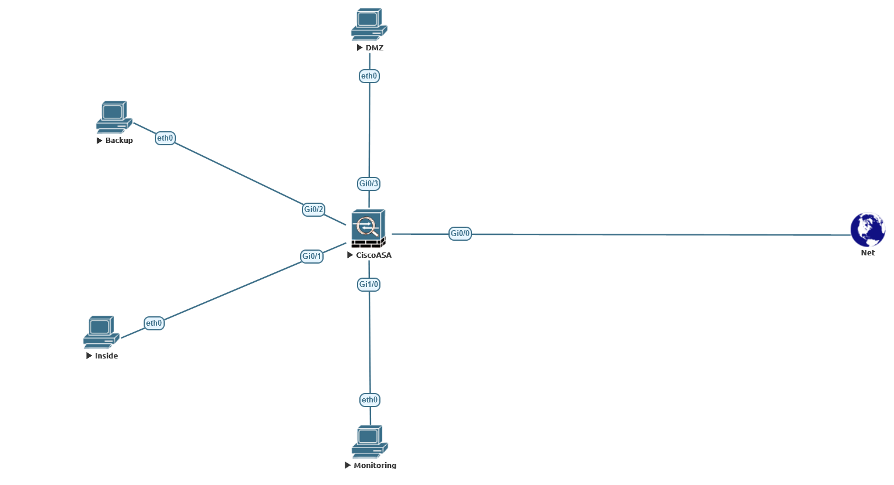

# **crpnt_8_3_arb**

## Лабораторная работа "Построение корпоративной сети"

На схеме представлена топология сети офиса:



На офисном МЭ - CiscoASA есть 5 интерфейсов, 4 для сегментации локальной сети и 1 публичная сеть (Outside):

- Inside - Gi0/1 - Vlan 10 - 192.168.10.1/24
- Backup - Gi0/2 - Vlan 20 - 192.168.20.1/24
- DMZ - Gi0/3 - Vlan 30 - 192.168.30.1/24
- Monitoring - Gi1/0 - Vlan 40 - 192.168.40.1/24
- Outside- Gi0/0 - vlan 50 - 100.100.100.1/24

Необходимо создать зоны с уровнями безопасности (security-level) следующим образом:

- Из Inside можно подключаться ко всем сетям.
- Из Backup можно подключаться ко всем, кроме Inside.
- Из Monitoring можно подключаться только к DMZ и Outside.
- Из DMZ можно подключаться только к Outside.

Каким образом надо назначить уровни безопасности на интерфейсы Cisco ASA?

Отправьте список интерфейсов Cisco Asa с security-level

## Решение.

Основное правило ASA: Трафик с интерфейса с более высоким уровнем безопасности на интерфейс с более низким уровнем безопасности разрешен по умолчанию. Трафик с низкого на высокий по умолчанию заблокирован (требуется явное правило ACL).

Для реализации условий задачи необходимо на соответствующих интерфейсах настроить следующие уровни security-level:

```
interface GigabitEthernet0/0
 nameif Outside
 security-level 0
 ip address 100.100.100.1 255.255.255.0


interface GigabitEthernet0/1
 nameif Inside
 security-level 100
 ip address 192.168.10.1 255.255.255.0


interface GigabitEthernet0/2
 nameif Backup
 security-level 30
 ip address 192.168.20.1 255.255.255.0


interface GigabitEthernet0/3
 nameif DMZ
 security-level 10
 ip address 192.168.30.1 255.255.255.0


interface GigabitEthernet1/0
 nameif Monitoring
 security-level 20
 ip address 192.168.40.1 255.255.255.0

```