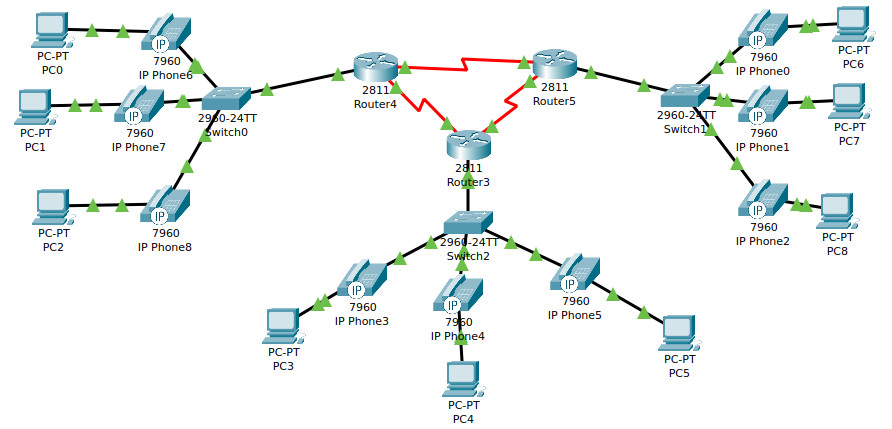
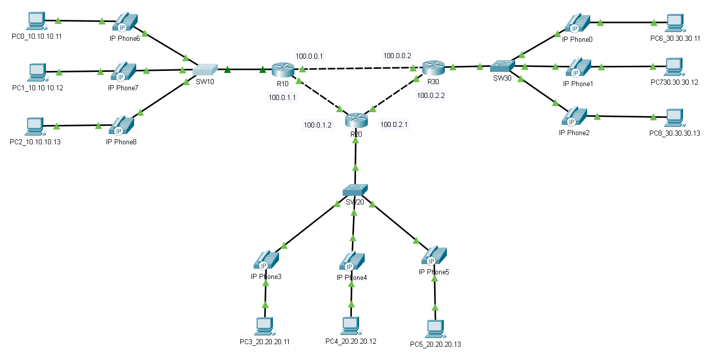
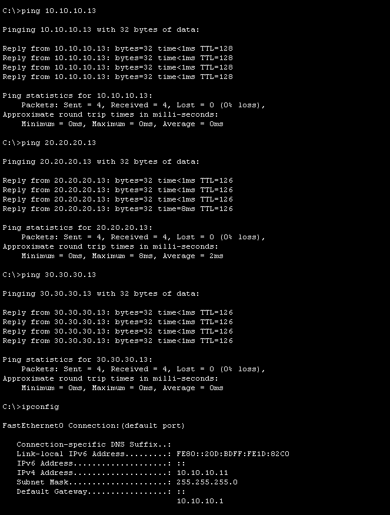

# **ipnt_arb**

## Задание 1. Лабораторная работа «Настройка IP-телефонии в сети простой конфигурации»

1. Соберите сеть в Cisco Packet Tracer согласно топологии, которая представлена на картинке ниже:

2. Для левой части сети все компьютеры поместите в vlan 10, подсеть 10.10.10.0/24.
3. Для левой части сети все телефоны поместите в vlan 11, подсеть 10.10.11.0/24.
4. Для центральной части сети все компьютеры поместите в vlan 20, подсеть 20.20.20.0/24.
5. Для центральной части сети все телефоны поместите в vlan 21, подсеть 20.20.21.0/24.
6. Для правой части сети все компьютеры поместите в vlan 30, подсеть 30.30.30.0/24.
7. Для правой части сети все телефоны поместите в vlan 31, подсеть 30.30.31.0/24.
8. На маршрутизаторах включить настроить OSPF так, чтобы все обеспечить полную связь между всеми частями сети (все компьютеры должны пинговать друг друга).

Примечание: 4 октет на всех устройствах произвольный. Обязательно используйте CDP для передачи voice vlan.

В качестве ответа приложите файл .pkt

## Решение 1.

### Замечание по выполнению ДЗ:

Задание 1 - телефоны не получают IP адреса.

### Решение

Настроил DHCP на всех маршрутизаторах:

```
R20(config)#ip dhcp pool VOICE
R20(dhcp-config)#network 20.20.21.0 255.255.255.0
R20(dhcp-config)#default-router 20.20.21.1
R20(dhcp-config)#option 150 ip 20.20.21.1

R20(config)#ip dhcp pool DATA
R20(dhcp-config)#network 20.20.20.0 255.255.255.0
R20(dhcp-config)#default-router 20.20.20.1
```
Файл .pkt [ДЗ_ipnt_10.2_arb_v1.pkt](arch/ДЗ_ipnt_10.2_arb_v1.pkt)

---

Схему собрал, настроил:



Оценим связность между всеми частями сети:



Файл .pkt

[ДЗ_ipnt_10.2_arb.pkt](arch/ДЗ_ipnt_10.2_arb.pkt)


## Задание 2.

Опишите преимущества использования Voice vlan по сравнению с инфраструктурой, где голосовой и прочий пользовательский трафик находятся в одном и том же VLAN.

Приведите ответ в свободной форме

## Решение 2.

Преимущества Voice VLAN перед единой VLAN:

1. QoS и приоритет голоса. Гарантирует низкую задержку (< 150 мс) и джиттер (< 30 мс) за счёт политик QoS (CoS 5 / DSCP EF).
2. Изоляция трафика. Голосовой трафик не страдает из‑за загруженности сети (массовые загрузки, видео и т. д.).
3. Безопасность. Ограничение доступа к VoIP‑устройствам, снижение риска атак (ARP spoofing, VLAN hopping).
4. Упрощённое управление. Централизованные настройки для IP‑телефонов, автоматическая классификация через CDP/LLDP.
5. Меньший широковещательный домен. В Voice VLAN только телефоны и VoIP‑сервер — меньше ARP/DHCP‑запросов и риска штормов.
6. Лёгкая диагностика. Проблемы с голосом локализуются сразу в пределах Voice VLAN.
7. Масштабируемость. Можно выделять дополнительные Voice VLAN по отделам/этажам без влияния на данные.
8. Соответствие стандартам. Соответствует ITU‑T G.114, PCI DSS и рекомендациям вендоров (Cisco и др.).