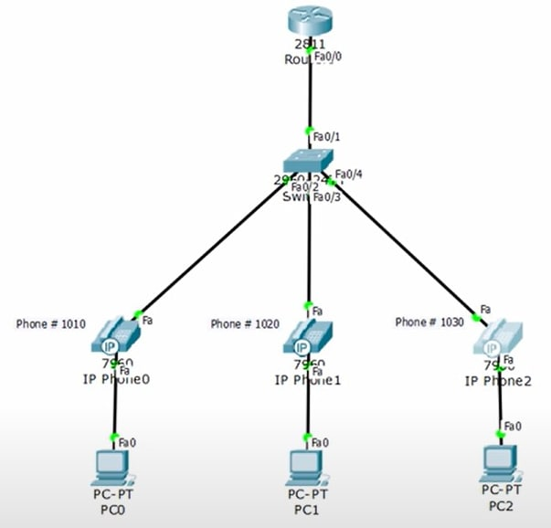
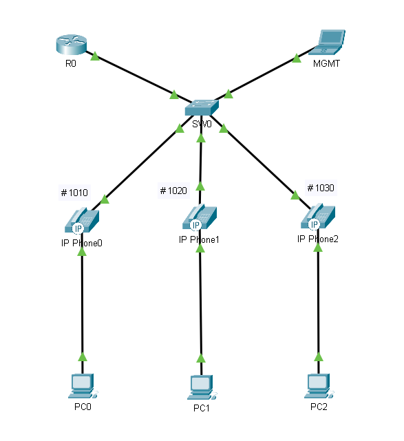
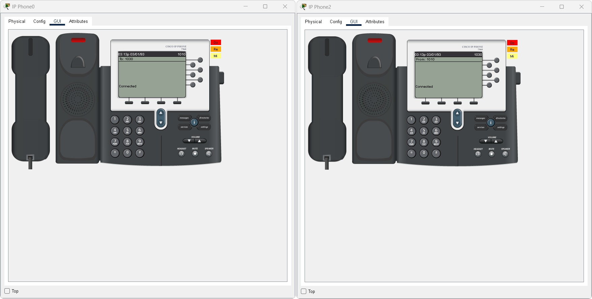
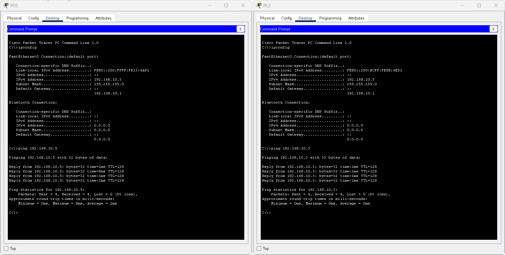
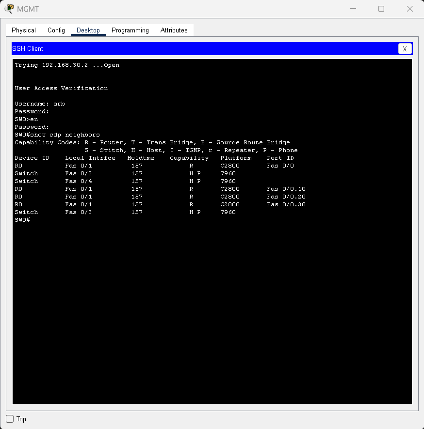

# **ipnt_arb**

## Задание 1. Лабораторная работа "Настройка IP-телефонии в сети простой конфигурации"

1. В Cisco Packet Tracer собрать сеть согласно топологии на картинке ниже:

2. Список VLAN:
    - VLAN 10 - DATA
    - VLAN 20 - VOICE
    - VLAN 30 - MANAGEMENT
3. Настроить коммутатор:
    - Добавить VLAN'ы
    - Прописать IP для управления - 192.168.30.2/24
    - Порт Fa0/1 - trunk, Fa0/2-Fa0/4 - access vlan 10 + voice vlan 20
4. Настроить маршрутизатор на работу по протоколу SCCP:
    - Использовать сабинтерфейсы в соответствующих VLAN'ах. IP-адреса - 192.168.10.1/24, 192.168.20.1/24, 192.168.30.1/24
    - Поднять DHCP серверы в vlan 10 и 20. DHCP во vlan 20 использует option 150, который указывает на себя же (192.168.20.1)
    - В разделе telephony-service указать source (192.168.20.1)
    - Создать номера 1010, 1020, 1030
    - Прописать номера на соответствующих аппаратах
5. Провести тестовый звонок с телефона 1010 на 1030, убедиться что всё работает.
6. Провести ping с компьютера PC0 на PC2

В качестве ответа приложите файл .pkt и скриншоты ping'а из п.6

## Решение 1.

Сеть собрал, настроил согласно заданию.
Пароль arb для доступа в привилированный режим, для пользователя arb аналогичный.

Проведем тестовый звонок с телефона 1010 на 1030:

Проверим связь PC0 и PC2:

Проверим управление коммутатором с MGMT:

Файл .pkt

## Задание 2.

Как вы думаете, для чего нужен Voice VLAN и что будет, если его не использовать?

Приведите ответ в свободной форме.

## Решение 2.

Voice VLAN — выделенная виртуальная сеть для голосового трафика (IP‑телефонов).

Зачем нужен:

1. Разделяет голос и данные — чтобы они не мешали друг другу.
2. Обеспечивает приоритет (QoS) — голосовые пакеты обрабатываются первыми, что даёт стабильное качество связи.
3. Упрощает настройку — IP‑телефоны автоматически получают IP и конфигурацию (через DHCP/TFTP).
4. Повышает безопасность — изоляция VoIP‑трафика снижает риски атак.
5. Поддерживает подключение ПК через телефон — трафик данных и голоса идёт по разным VLAN через один кабель.
6. Облегчает диагностику — проще искать проблемы в изолированном сегменте.

Что будет без Voice VLAN:

1. Плохое качество связи — задержки (>150–200 мс), джиттер, потери пакетов (>1–2%) из‑за конкуренции с трафиком данных.
2. Нет приоритета — голос обрабатывается наравне с загрузкой файлов или обновлениями.
3. Сложности с настройкой — QoS придётся настраивать вручную на каждом устройстве.
4. Рост нагрузки на сеть — широковещательный трафик от телефонов влияет на все устройства.
5. Риски безопасности — VoIP‑устройства доступны из общей сети, легче атаковать.
6. Проблемы с масштабированием — при добавлении телефонов сеть становится нестабильной.

Voice VLAN критически важен для качественной VoIP‑связи в корпоративных сетях. Без него связь может быть прерывистой и ненадёжной.