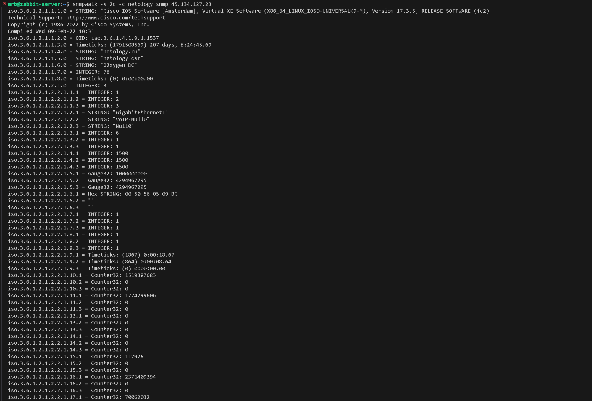

# **ДЗ_9.2.optnt_arb**

## Доступ к виртуальному маршрутизатору Cisco CSR по ssh:

IP: 45.134.127.23
Логин: netology_student
Пароль: iamanetworkengineer!23

## Задание 1

Что нужно сделать:

- С помощью snmpwalk запросите все доступные данные у хоста:
        
        IP:                     45.134.127.23
        SNMP READ Community:    netology_snmp

Решение отправьте в виде скриншота, где будет видна часть полученных данных от опрашиваемого хоста

## Решение 1

С помощью iReasoning MIB Browser: 

С помощью snmp linux:

## Задание 2

Что нужно сделать:

1. Установить Zabbix на виртуальную машину.
2. Добавить хост для мониторинга со следующими параметрами:

        Имя: netology_csr
        Адрес SNMP: 45.134.127.23
        SNMP Community: netology_snmp

3. Прикрепить к хосту встроенный в заббикс шаблон Cisco IOS versions 12.0._3_T-12.2_3.5 by SNMP.
4. Подождать 2 минуты и перейти в Latest data по хосту netology_csr.  

Решение отправьте в виде скриншота, где будут видны полученные данные от netology_csr

## Решение 2

Zabbix установлен, хост добавлен:

Смотрим Latest data:

