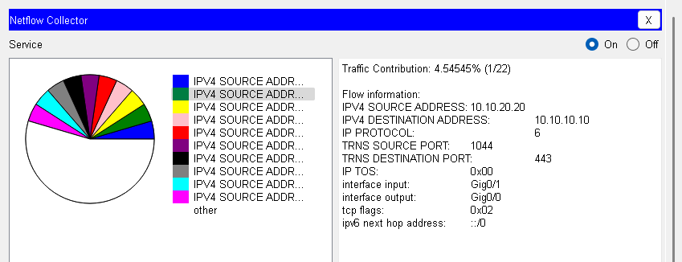
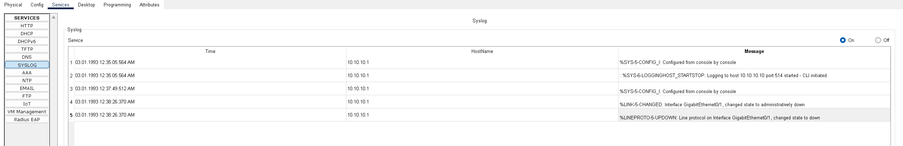

# **ДЗ_9.3.optnt_arb**

## Задание 1

Что нужно сделать:

- Сконфигурировать NetFlow на маршрутизаторе для отправки данных на сервер.
- NetFlow должен собирать следующие параметры из трафика:
    - Source/Destination IP
    - ToS byte, tcp flags
    - next-hop

Запустить пинги и телнеты на разные порты между двумя компьютерами.

Пришлите конфигурацию маршрутизатора и скрины NetFlow коллектора

## Решение 1

Собираем схему:


Настройка R1:

```

R1(config)#flow record NR

R1(config-flow-record)#match ipv4 source address 
R1(config-flow-record)#match ipv4 destination address 
R1(config-flow-record)#match ipv4 protocol 
R1(config-flow-record)#match transport source-port 
R1(config-flow-record)#match transport destination-port 
R1(config-flow-record)#match ipv4 tos 
R1(config-flow-record)#collect interface input 
R1(config-flow-record)#collect interface output 
R1(config-flow-record)#collect transport tcp flags 
R1(config-flow-record)#collect routing next-hop address ipv4

R1(config)#flow exporter NE

R1(config-flow-exporter)#destination 10.10.10.10
R1(config-flow-exporter)#transport udp 9996
R1(config-flow-exporter)#source gigabitEthernet 0/0

R1(config)#flow monitor NM

R1(config-flow-monitor)#record NR
R1(config-flow-monitor)#exporter NE

R1(config)#interface gigabitEthernet 0/0

R1(config-if)#ip flow monitor NM input 
R1(config-if)#ip flow monitor NM output 
```

Конфигурация R1:


Смотрим Netflow Collector:




## Задание 2

Что нужно сделать:

- Сконфигурировать Syslog на маршрутизаторе для отправки данных на сервер.
- Выключите gi0/1 на интерфейсе маршрутизатора и получите syslog сообщение на сервере.

Пришлите конфигурацию маршрутизатора и скрины полученных логов.


## Решение 2

Настройка R1:

```
R1(config)#logging host 10.10.10.10
R1(config)#logging trap debugging 
R1(config)#service timestamps log datetime msec
```
Конфигурация R1:


Отключаем gigabitEthernet 0/1 и смотрим:


