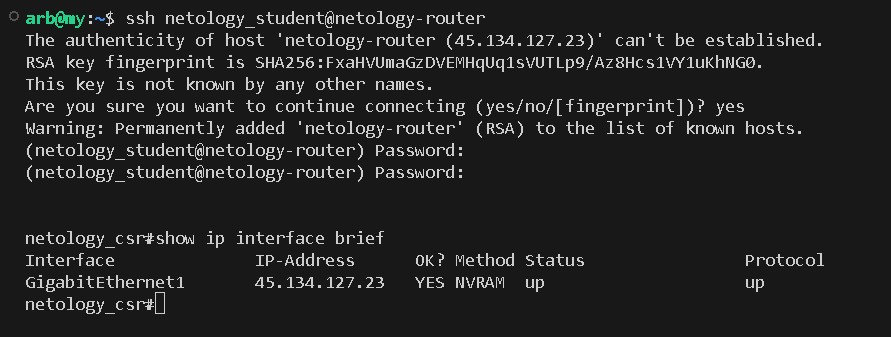
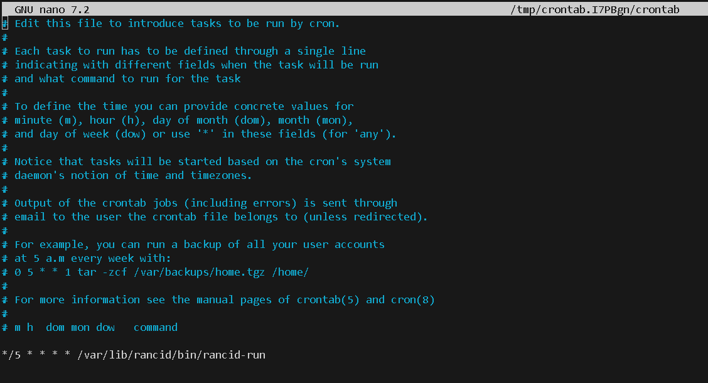
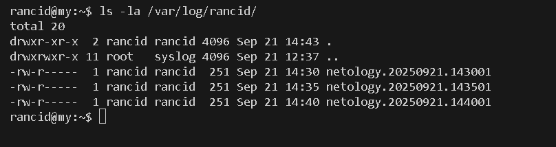

# **ДЗ_9.3.optnt_arb**

# Лабораторная работа "Бэкап и восстановление конфигурации АСО"

## Инструкция к выполнению:

1. Установите ПО Rancid на виртуальной машине, следуя шагам на слайдах
2. Проверьте, создался ли пользователь rancid. Если нет, создайте его, установите пароль и дайте права к папкам из инструкции
3. Создайте запись в hosts для тестового маршрутизатора. Назовите его netology-router
4. Проверьте доступ по ssh к виртуальному маршрутизатору
5. Выполните базовые настройки Rancid

## Доступ к виртуальному маршрутизатору Cisco CSR по ssh:

        IP: 45.134.127.23
        Логин: netology_student
        Пароль: iamanetworkengineer!23

## Задание 1

Что нужно сделать:

1. Вместо команды show running-config настройте выполнение команды sh startup-config.
2. Все остальные команды сбора статистики и логов закомментируйте. Должна остаться только команда сбора конфигурации.
3. Запустите процесс сбора данных rancid.
4. Убедитесь, что диагностические команды выполнены и сохранены в файл.

В качестве ответа приложите файл, созданный rancid и файл конфигурации, в который вносились изменения по заданию.

## Решение 1

ПО Rancid установлено, пользователю rancid задан пароль, запись в hosts создана.
Проверим доступ по ssh:



Донастроим Rancid:
```
sudo nano /etc/rancid/rancid.conf                           # добавим в конфигурацию LIST_OF_GROUPS="netology"; export LIST_OF_GROUPS
sudo apt install cvs                                        # установка пакета CVS
sudo su -c /var/lib/rancid/bin/rancid-cvs rancid            # создание репозитория CVS для хранения конфигураций
```
Проверим наличие каталога с именем группы устройств:


Настроим /var/lib/rancid/netology/router.db, добавив запись:
```
netology-router;cisco;up
```

Настроим /var/lib/rancid/.cloginrc, установив режим 0600 и добавив следующее:
```
add method netology-router ssh
add user netology-router netology_student
add password netology-router iamanetworkengineer!23
add noenable * 1
```
Меняем в файле /etc/rancid/rancid.types.base команду show running-config на show startup-config, остальное закомментируем.

Выполняем скрипт сбора конфигурации от пользователя rancid
```
/var/lib/rancid/bin/rancid-run 
```

Созданный rancid файл и файл rancid.types.base

[netology-router](arch/netology-router)
[rancid.types.base](arch/rancid.types.base)


## Задание 2

Что нужно сделать:

1. Удалите созданный rancid файл конфигураций тестового роутера.
2. Настройте cron на запуск rancid раз в 5 минут.
3. Подождите 10 минут.
4. Убедитесь, что диагностические команды выполнены. И сохранены в файл.

В качестве ответа приложите настройку cron

## Решение 2

Настройка cron:



Логи создаются каждые 5 минут:

