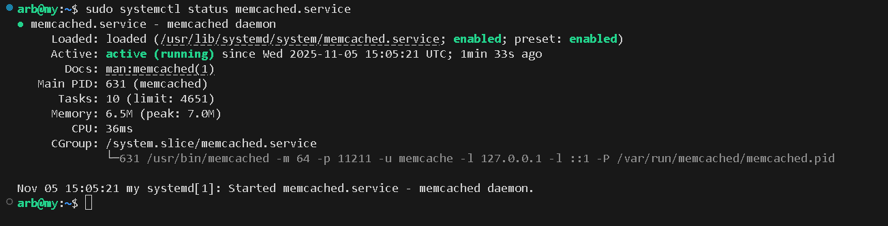
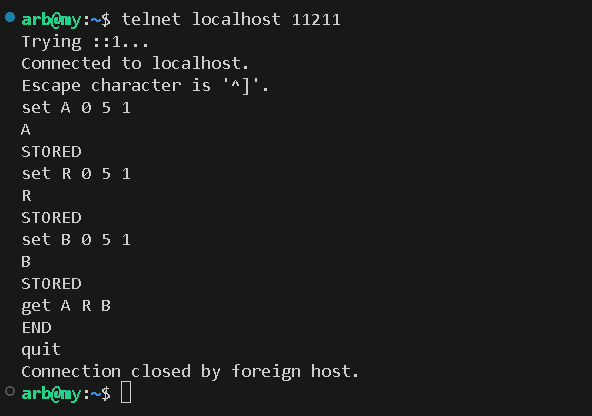
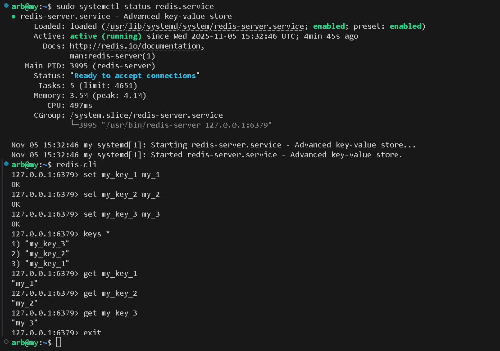
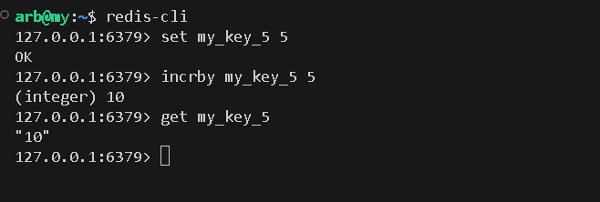

# **sdb_02_arb**

## Задание_1_Кеширование

Приведите примеры проблем, которые может решить кеширование.

## Решение 1

1. Высокая задержка (Latency) - данные доставляются из быстрого хранилища (ОЗУ) рядом с пользователем.
2. Низкая пропускная способность (Throughput) - система обрабатывает больше запросов в секунду, так как не ходит за каждым из них в медленный источник.
3. Пиковые нагрузки - принимает на себя "ударную волну" трафика, защищая основную систему.
4. Низкая отказоустойчивость - позволяет системе работать даже при временной недоступности первичного источника данных.
5. Высокая стоимость инфраструктуры - снижает нагрузку на дорогие системы (БД, внешние API), экономя деньги.

Кеширование не решает проблемы, связанные с записью или консистентностью данных по умолчанию. Оно создает дополнительный слой, с которым нужно правильно работать (инвалидация кеша, стратегии записи), чтобы не получить устаревшие (неконсистентные) данные.


## Задание_2_Memcached

Установите и запустите memcached.
Приведите скриншот systemctl status memcached, где будет видно, что memcached запущен.

## Решение 2

Установка:
```
sudo apt install memcached 
```

Проверка:




## Задание_3_Удаление по TTL в Memcached

Запишите в memcached несколько ключей с любыми именами и значениями, для которых выставлен TTL 5.
Приведите скриншот, на котором видно, что спустя 5 секунд ключи удалились из базы.

## Решение 3




## Задание_4_Запись данных в Redis

Запишите в Redis несколько ключей с любыми именами и значениями.
Через redis-cli достаньте все записанные ключи и значения из базы, приведите скриншот этой операции.

## Решение 4




## Задание_5_Работа с числами

Запишите в Redis ключ key5 со значением типа "int" равным числу 5. Увеличьте его на 5, чтобы в итоге в значении лежало число 10.
Приведите скриншот, где будут проделаны все операции и будет видно, что значение key5 стало равно 10.

## Решение 4

