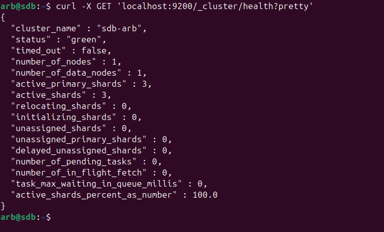
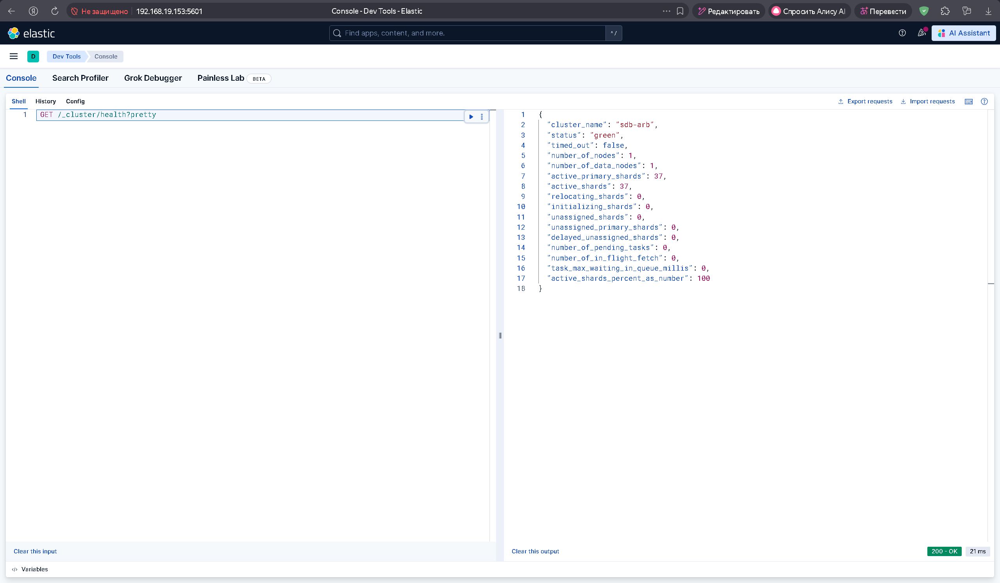
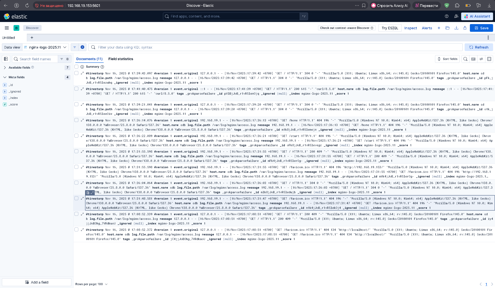
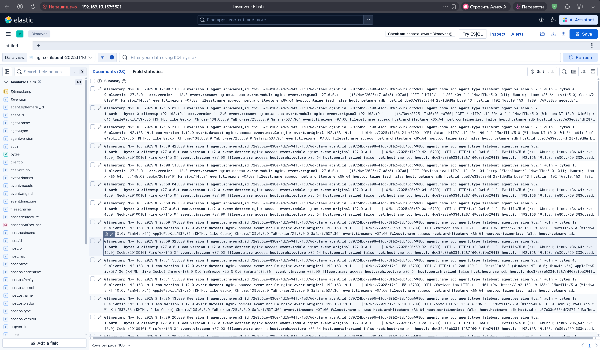

# **sdb_03_arb**

## Задание_1_Elasticsearch

Установите и запустите Elasticsearch, после чего поменяйте параметр cluster_name на случайный.
Приведите скриншот команды 'curl -X GET 'localhost:9200/_cluster/health?pretty', сделанной на сервере с установленным Elasticsearch. Где будет виден нестандартный cluster_name.

## Решение 1

Установка:
```
wget -qO - https://artifacts.elastic.co/GPG-KEY-elasticsearch | sudo gpg --dearmor -o /usr/share/keyrings/elasticsearch-keyring.gpg
sudo apt-get install apt-transport-https
echo "deb [signed-by=/usr/share/keyrings/elasticsearch-keyring.gpg] https://artifacts.elastic.co/packages/9.x/apt stable main" | sudo tee /etc/apt/sources.list.d/elastic-9.x.list
sudo apt-get update && sudo apt-get install elasticsearch
```
Вывод команды:




## Задание_2_Kibana

Установите и запустите Kibana.
Приведите скриншот интерфейса Kibana на странице http://<ip вашего сервера>:5601/app/dev_tools#/console, где будет выполнен запрос GET /_cluster/health?pretty.

## Решение 2

Установка:
```
wget -qO - https://artifacts.elastic.co/GPG-KEY-elasticsearch | sudo gpg --dearmor -o /usr/share/keyrings/elasticsearch-keyring.gpg
sudo apt-get install apt-transport-https
echo "deb [signed-by=/usr/share/keyrings/elasticsearch-keyring.gpg] https://artifacts.elastic.co/packages/9.x/apt stable main" | sudo tee /etc/apt/sources.list.d/elastic-9.x.list
sudo apt-get update && sudo apt-get install kibana
```

Скриншот интерфейса, с выполненным запросом:




## Задание_3_Logstash

Установите и запустите Logstash и Nginx. С помощью Logstash отправьте access-лог Nginx в Elasticsearch.
Приведите скриншот интерфейса Kibana, на котором видны логи Nginx.

## Решение 3

Установка:
```
wget -qO - https://artifacts.elastic.co/GPG-KEY-elasticsearch | sudo gpg --dearmor -o /usr/share/keyrings/elasticsearch-keyring.gpg
sudo apt-get install apt-transport-https
echo "deb [signed-by=/usr/share/keyrings/elasticsearch-keyring.gpg] https://artifacts.elastic.co/packages/9.x/apt stable main" | sudo tee /etc/apt/sources.list.d/elastic-9.x.list
sudo apt-get update && sudo apt-get install logstash
```

Создаем конфигурацию /etc/logstash/conf.d/nginx.conf
```
input {
  file {
    path => ["/var/log/nginx/access.log"]
    start_position => "beginning"
  }
}

filter {
  grok {
    match => { "message" => "\[%{TIMESTAMP_ISO8601:timestamp}\]\[%{DATA:severity}%{SPACE}\]\[%{DATA:source}%{SPACE}\]%{SPACE}%{GREEDYDATA:message}" }
    overwrite => [ "message" ]
  }
}

output {
  elasticsearch {
    hosts => ["http://localhost:9200"]
    index => "nginx-logs-%{+YYYY.MM}"
  }
}
```

Создаем data view в kibana: Management > stack management > kibana > data view > Create data view

Смотрим логи:




## Задание_4_Filebeat

Установите и запустите Filebeat. Переключите поставку логов Nginx с Logstash на Filebeat.
Приведите скриншот интерфейса Kibana, на котором видны логи Nginx, которые были отправлены через Filebeat.

## Решение 4

Установка:
```
curl -L -O https://artifacts.elastic.co/downloads/beats/filebeat/filebeat-9.2.1-amd64.deb
sudo dpkg -i filebeat-9.2.1-amd64.deb
```

Включаем обработку логов nginx:
```
mv /etc/filebeat/modules.d/nginx.yml.disabled /etc/filebeat/modules.d/nginx.yml
```

Файл /etc/filebeat/modules.d/nginx.yml:
```
- module: nginx
  # Access logs
  access:
    enabled: true

    # Set custom paths for the log files. If left empty,
    # Filebeat will choose the paths depending on your OS.
    var.paths: ["/var/log/nginx/access.log"]

  # Error logs
  error:
    enabled: true

    # Set custom paths for the log files. If left empty,
    # Filebeat will choose the paths depending on your OS.
    var.paths: ["/var/log/nginx/error.log"]

  # Ingress-nginx controller logs. This is disabled by default. It could be used in Kubernetes environments to parse ingress-nginx logs
  ingress_controller:
    enabled: false
```

Файл /etc/filebeat/filebeat.yml:
```
filebeat.inputs:

- type: filestream
 	id: my-filestream-id
	enabled: false
	paths:
		- /var/log/*.log

filebeat.config.modules:
  
  	path: ${path.config}/modules.d/*.yml
  	reload.enabled: true
	reload.period: 10s


setup.template.settings:
  	index.number_of_shards: 1

setup.kibana:

   	host: "localhost:5601"

output.logstash:
  
  	hosts: ["localhost:5044"]

 processors:
  	- add_host_metadata:
      		when.not.contains.tags: forwarded
  	- add_cloud_metadata: ~
  	- add_docker_metadata: ~
  	- add_kubernetes_metadata: ~
```

Конфигурационный файл logstash:
```
input {
  beats {
    port => 5044
  }
}

output {
  elasticsearch {
    hosts => ["localhost:9200"]
#    manage-template => false
    index => "nginx-filebeat-%{+YYYY.MM.dd}"
  }
  stdout { codec => rubydebug }
}

filter {
  if [event][dataset] == "nginx.access" {
    grok {
      match => [ "message" , "%{IPORHOST:clientip} %{USER:ident} %{USER:auth} \[%{HTTPDATE:timestamp}\] \"(?:%{WORD:verb} %{NOTSPACE:request}(?: HTTP/%{NUMBER:httpversion})?|%{DATA:rawrequest})\" %{NUMBER:response} (?:%{NUMBER:bytes}|-) %{QS:referrer} %{QS:user_agent}"]
      overwrite => [ "message" ]
    }
    mutate {
      convert => ["response", "integer"]
      convert => ["bytes", "integer"]
      convert => ["responsetime", "float"]
    }
    date {
      match => [ "timestamp" , "dd/MMM/YYYY:HH:mm:ss Z" ]
      remove_field => [ "timestamp" ]
    }
  }
}
```

Смотрим логи:

