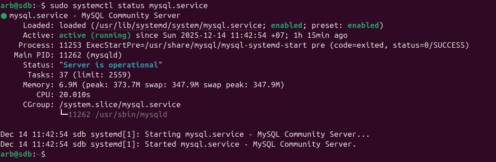
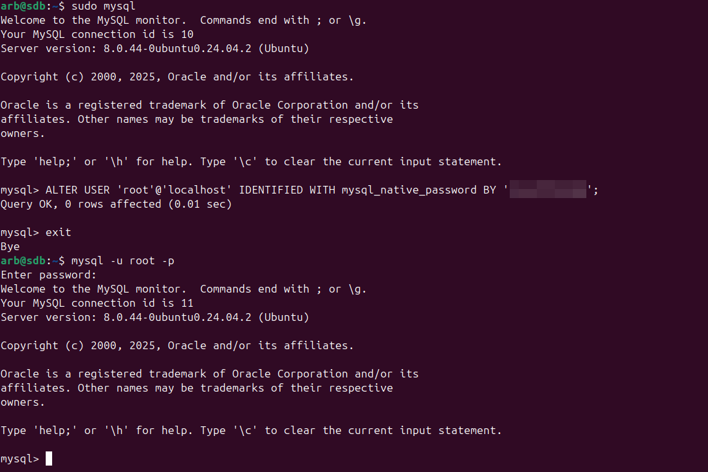
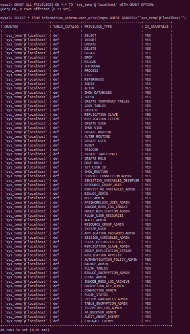
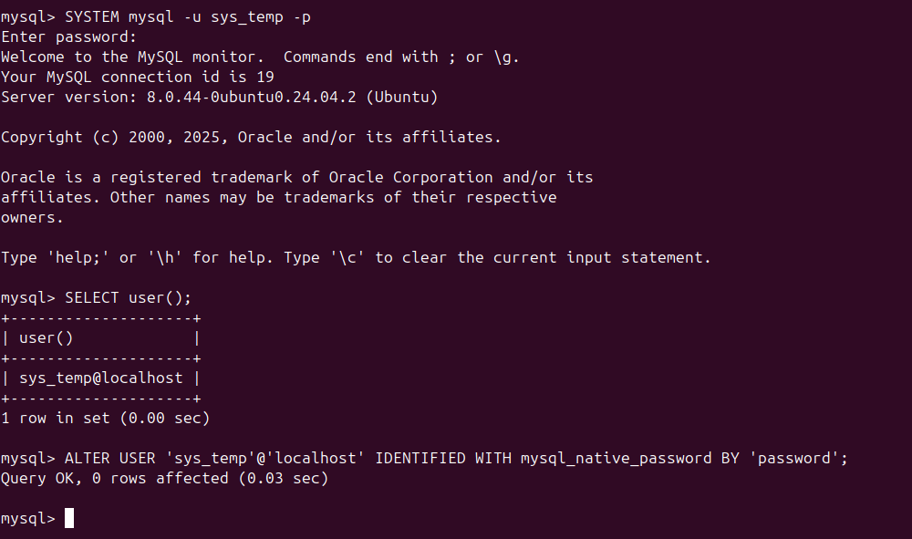
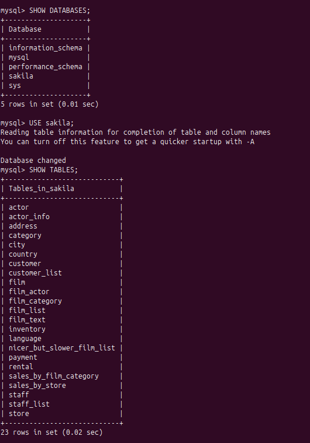
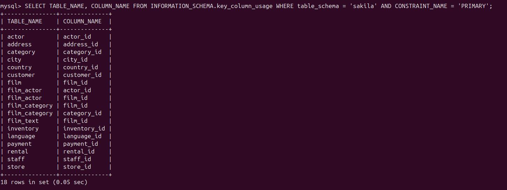
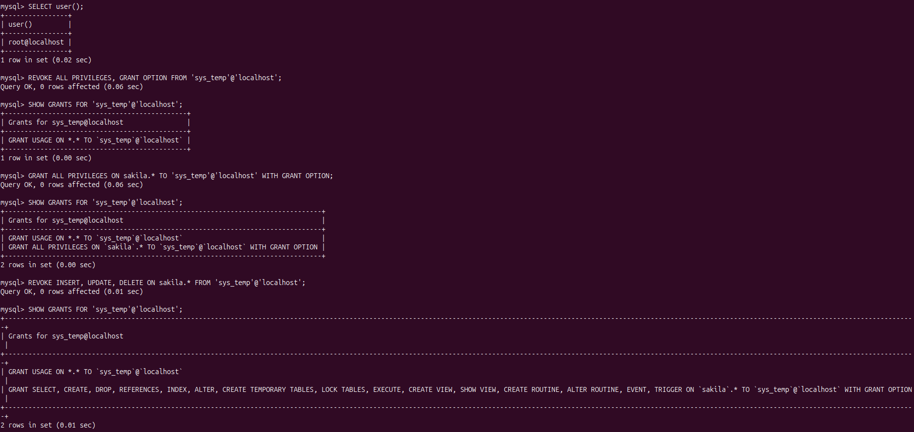

# **sdb_12_1_arb**

## Задание_1

1. Поднимите чистый инстанс MySQL версии 8.0+. Можно использовать локальный сервер или контейнер Docker.
2. Создайте учётную запись sys_temp.
3. Выполните запрос на получение списка пользователей в базе данных. (скриншот)
4. Дайте все права для пользователя sys_temp.
5. Выполните запрос на получение списка прав для пользователя sys_temp. (скриншот)
6. Переподключитесь к базе данных от имени sys_temp.

Для смены типа аутентификации с sha2 используйте запрос:

ALTER USER 'sys_test'@'localhost' IDENTIFIED WITH mysql_native_password BY 'password';
7. По ссылке https://downloads.mysql.com/docs/sakila-db.zip скачайте дамп базы данных.
8. Восстановите дамп в базу данных.
9. При работе в IDE сформируйте ER-диаграмму получившейся базы данных. При работе в командной строке используйте команду для получения всех таблиц базы данных. (скриншот)

Результатом работы должны быть скриншоты обозначенных заданий, а также простыня со всеми запросами.

## Решение_1

1. Установка, базовая настройка MySQL:

```
sudo apt install mysql-server mysql-client
sudo mysql_secure_installation
sudo mysql
mysql> ALTER USER 'root'@'localhost' IDENTIFIED WITH mysql_native_password BY '************';
```



2. Создаем пользователя sys_temp и выводим список:

```
CREATE USER 'sys_temp'@'host' IDENTIFIED BY 'password';
SELECT user FROM mysql.user;
```


3. Даем и выводим список прав пользователя sys_temp:

```
GRANT ALL PRIVILEGES ON *.* TO 'sys_temp'@'localhost' WITH GRANT OPTION;
SELECT * FROM information_schema.user_privileges WHERE GRANTEE="'sys_temp'@'localhost'";
```


4. Подключаемся от имени пользователя sys_temp и меняем тип аутентификации:

```
SYSTEM mysql -u sys_temp -p
SELECT user();
ALTER USER 'sys_temp'@'localhost' IDENTIFIED WITH mysql_native_password BY 'password';
```


5. Качаем, восстанавливаем дамп в базу и выводим список таблиц:

```
wget https://downloads.mysql.com/docs/sakila-db.zip
unzip sakila-db.zip
```
```
source /home/arb/sakila-db/sakila-schema.sql
source /home/arb/sakila-db/sakila-schema.sql
SHOW DATABASES;
USE sakila;
SHOW TABLES;
```



## Задание_2

Составьте таблицу, используя любой текстовый редактор или Excel, в которой должно быть два столбца: в первом должны быть названия таблиц восстановленной базы, во втором названия первичных ключей этих таблиц. 

## Решение_2

```
SELECT TABLE_NAME, COLUMN_NAME FROM INFORMATION_SCHEMA.key_column_usage WHERE table_schema = 'sakila' AND CONSTRAINT_NAME = 'PRIMARY';
```



## Задание_3

1. Уберите у пользователя sys_temp права на внесение, изменение и удаление данных из базы sakila.
2. Выполните запрос на получение списка прав для пользователя sys_temp. (скриншот)

Результатом работы должны быть скриншоты обозначенных заданий, а также простыня со всеми запросами.

## Решение_3

```
REVOKE ALL PRIVILEGES, GRANT OPTION FROM 'sys_temp'@'localhost';
GRANT ALL PRIVILEGES ON sakila.* TO 'sys_temp'@'localhost' WITH GRANT OPTION;
REVOKE INSERT, UPDATE, DELETE ON sakila.* FROM 'sys_temp'@'localhost';
SHOW GRANTS FOR 'sys_temp'@'localhost';
```
