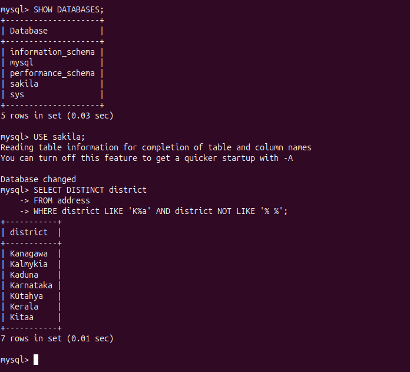
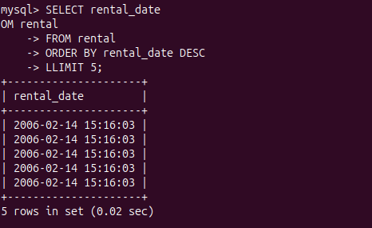
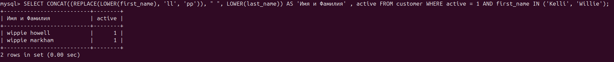

# **sdb_12_3_arb**

## Задание_1

Получите уникальные названия районов из таблицы с адресами, которые начинаются на “K” и заканчиваются на “a” и не содержат пробелов.

## Решение_1

```
SELECT DISTINCT district
FROM address
WHERE district LIKE 'K%a' AND district NOT LIKE '% %';
```



## Задание_2

Получите из таблицы платежей за прокат фильмов информацию по платежам, которые выполнялись в промежуток с 15 июня 2005 года по 18 июня 2005 года включительно и стоимость которых превышает 10.00.

## Решение_2

```
SELECT payment_date, amount
FROM payment
WHERE amount > 10 AND payment_date BETWEEN '2005-06-15 00:00:00' AND '2005-06-18 23:59:59';
```


## Задание_3

Получите последние пять аренд фильмов.

## Решение_3

```
SELECT rental_date
FROM rental
ORDER BY rental_date DESC
LIMIT 5;
```



## Задание_4

Получите последние пять аренд фильмов.

## Решение_4

```
SELECT CONCAT((REPLACE(LOWER(first_name), 'll', 'pp')), " ", LOWER(last_name)) AS 'Имя и фамилия' , active
FROM customer
WHERE active = 1 AND first_name IN ('Kelly', 'Willie');
```
