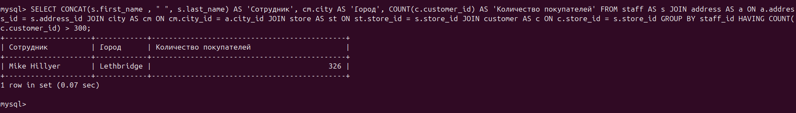
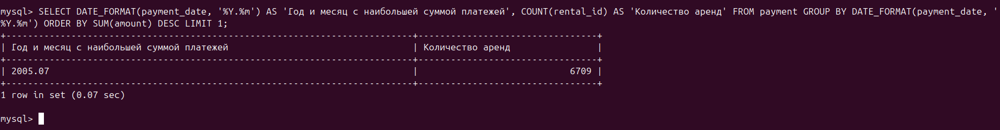

# **sdb_12_4_arb**

## Задание_1

Одним запросом получите информацию о магазине, в котором обслуживается более 300 покупателей, и выведите в результат следующую информацию:

- фамилия и имя сотрудника из этого магазина;
- город нахождения магазина;
- количество пользователей, закреплённых в этом магазине.

## Решение_1

```
SELECT CONCAT(s.first_name , " ", s.last_name) AS 'Сотрудник', cm.city AS 'Город', COUNT(c.customer_id) AS 'Количество покупателей'
FROM staff AS s
JOIN address AS a ON a.address_id = s.address_id
JOIN city AS cm ON cm.city_id = a.city_id
JOIN store AS st ON st.store_id = s.store_id
JOIN customer AS c ON c.store_id = s.store_id
GROUP BY staff_id
HAVING COUNT(c.customer_id) > 300;
```



## Задание_2

Получите количество фильмов, продолжительность которых больше средней продолжительности всех фильмов.

## Решение_2

```
SELECT COUNT(length) AS 'Количество фильмов, продолжительность которых больше средней продолжительности всех фильмов'
FROM film
WHERE length > (SELECT AVG(length) FROM film);
```


## Задание_3

Получите информацию, за какой месяц была получена наибольшая сумма платежей, и добавьте информацию по количеству аренд за этот месяц.

## Решение_3

```
SELECT DATE_FORMAT(payment_date, '%Y.%m') AS 'Год и месяц c наибольшей суммой платежей', COUNT(rental_id) AS 'Количество аренд'
FROM payment
GROUP BY DATE_FORMAT(payment_date, '%Y.%m')
ORDER BY SUM(amount) DESC
LIMIT 1;
```
