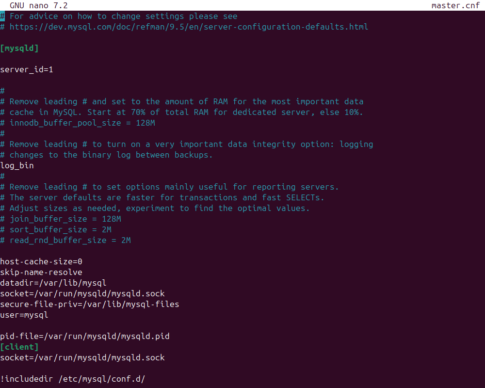
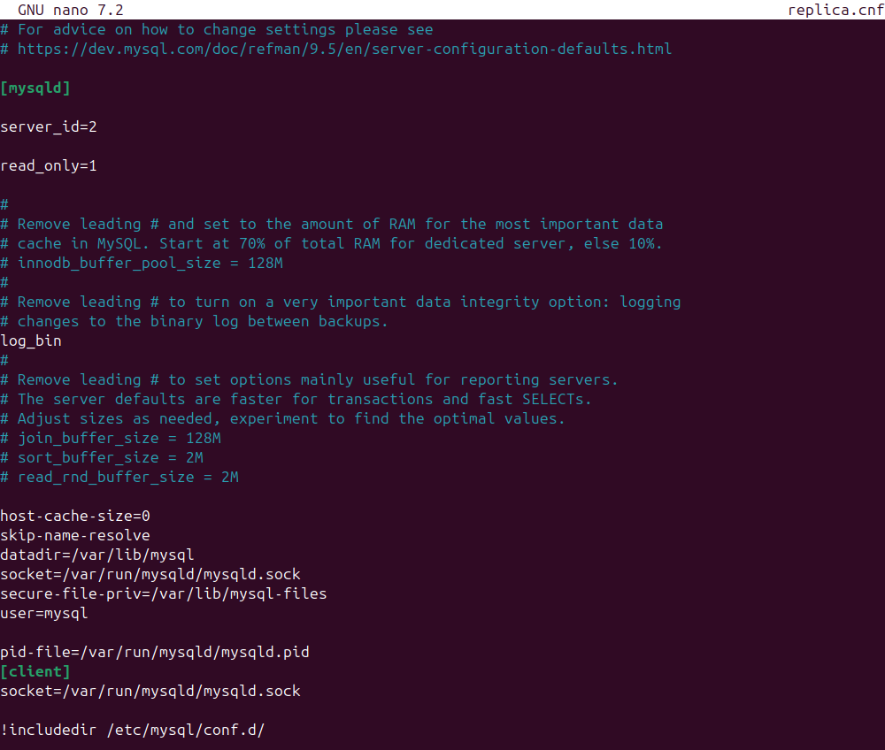
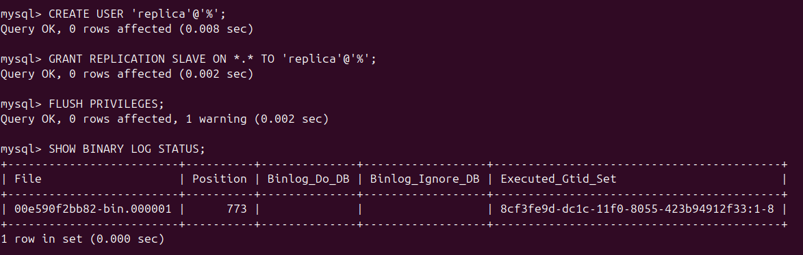
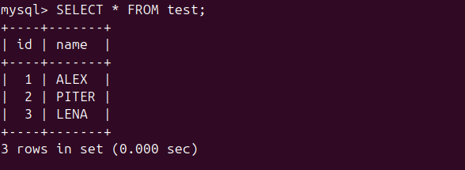
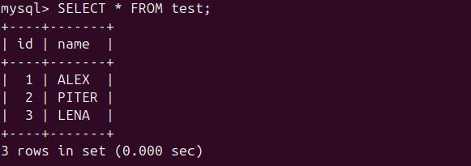

# **sdb_12_6_arb**

## Задание_1

На лекции рассматривались режимы репликации master-slave, master-master, опишите их различия.
Ответить в свободной форме.

## Решение_1

**Master-Slave** — это архитектура с строгой иерархией и однонаправленным потоком данных. Есть один главный источник истины (Master), куда пишут, и подчиненные копии (Slave), которые только читают.

**Master-Master** — это архитектура равноправных узлов с многонаправленным потоком данных. Каждый узел является одновременно и источником, и приёмником изменений.

Ключевые различия по аспектам:

1. Направление записи и роль узлов

- В Master-Slave запись возможна только на один-единственный узел — Master. Роли жёстко зафиксированы: Master для записи, Slave — только для чтения.
- В Master-Master запись может производиться на любой из узлов. Все узлы имеют равные права и могут как читать, так и писать.

2. Масштабирование

- Master-Slave позволяет эффективно масштабировать только операцию чтения, добавляя Slave-серверы. Операции записи всегда упираются в производительность одного Master-узла, который становится "бутылочным горлышком".
- Master-Master теоретически позволяет масштабировать и операции записи, распределяя их между несколькими узлами. Однако на практике этому часто мешают конфликты.

3. Отказоустойчивость

- В Master-Slave уязвимым местом является Master. Его отказ приводит к полной неработоспособности системы на запись до тех пор, пока не будет восстановлен он сам или не будет вручную выбран новый Master из Slave. Это единая точка отказа.
- Master-Master архитектура более отказоустойчива для операций записи. Если один из узлов выходит из строя, запись может продолжиться на других. Это повышает доступность системы.

4. Главная техническая проблема

- Основная проблема Master-Slave — задержка репликации. Данные на Slave-узлах на некоторое время отстают от Master, что приводит к временной несогласованности. Клиент, прочитавший данные с Slave, может увидеть устаревшую информацию.
- Основная и критически сложная проблема Master-Master — конфликты при записи. Если два клиента одновременно изменят одни и те же данные на разных Master-узлах, система столкнется с конфликтом репликации, который необходимо автоматически обнаруживать и разрешать по заранее заданным, часто нетривиальным правилам.

5. Сложность реализации и сопровождения

- Master-Slave — относительно простая, хорошо изученная и предсказуемая модель. Её настройка и поддержка не требуют чрезмерных усилий.
- Master-Master — сложная архитектура. Её внедрение требует глубокого проектирования (например, как избегать или минимизировать конфликты), выбора стратегии их разрешения, а также тщательного мониторинга. Поддержка такой системы дороже и требует высокой квалификации.

6. Гарантии согласованности данных

- В Master-Slave данные на Slave в конечном счёте становятся согласованными с Master. Модель обеспечивает согласованность в конечном итоге.
- В Master-Master из-за распределённой природы записи и задержек синхронизации гарантии согласованности ещё более ослаблены. Риск долговременной несогласованности выше, особенно при возникновении и некорректном разрешении конфликтов.


## Задание_2

Выполните конфигурацию master-slave репликации, примером можно пользоваться из лекции.
Приложите скриншоты конфигурации, выполнения работы: состояния и режимы работы серверов.

## Решение_2

Используем docker. 

```
sudo docker run --name master -e MYSQL_ROOT_PASSWORD=root -d mysql
sudo docker run --name replica -e MYSQL_ROOT_PASSWORD=root -d mysql
sudo docker network create replication
sudo docker network connect replication master
sudo docker network connect replication replica
```

Настроим конфигурацию mysql на master:

```
sudo docker cp master:/etc/my.cnf master.cnf
sudo docker cp master.cnf master:/etc/my.cnf
```


Теперь replica:

```
sudo docker cp replica:/etc/my.cnf replica.cnf
sudo docker cp replica.cnf replica:/etc/my.cnf
```




На master создаем пользователя для репликации:

```
sudo docker exec -it master mysql -uroot -proot
```
```
CREATE USER 'replica'@'%';
GRANT REPLICATION SLAVE ON *.* TO 'replica'@'%';
FLUSH PRIVILEGES;
SHOW BINARY LOG STATUS;
```



Настраиваем репликацию на replica:

```
sudo docker exec -it replica mysql -uroot -proot
```
```
CHANGE REPLICATION SOURCE TO SOURCE_HOST='master', SOURCE_USER='replica', RELAY_LOG_POS=773;
START REPLICA;
SHOW REPLICA STATUS\G;
```


Создаем БД на master:

```
CREATE DATABASE netology;
USE netology;
CREATE TABLE test (id INT NOT NULL AUTO_INCREMENT, name VARCHAR(255), PRIMARY KEY(id));
INSERT INTO test (name) VALUES ('ALEX'), ('PITER'), ('LENA');
SELECT * FROM test;
```



Посмотрим на replica:

```
USE netology;
SELECT * FROM test;
```
