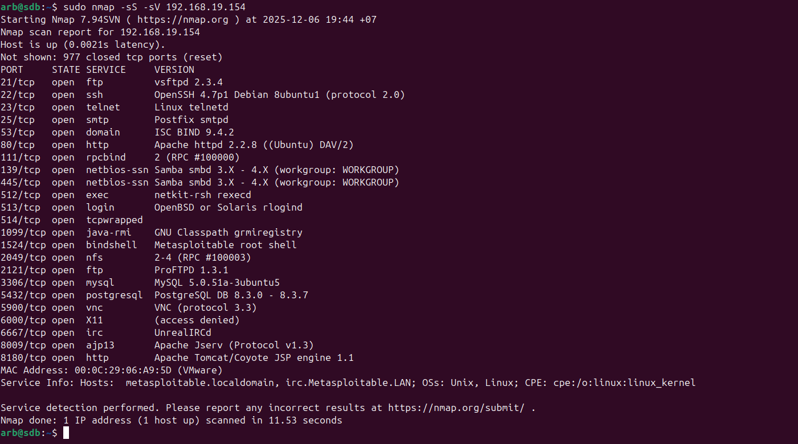
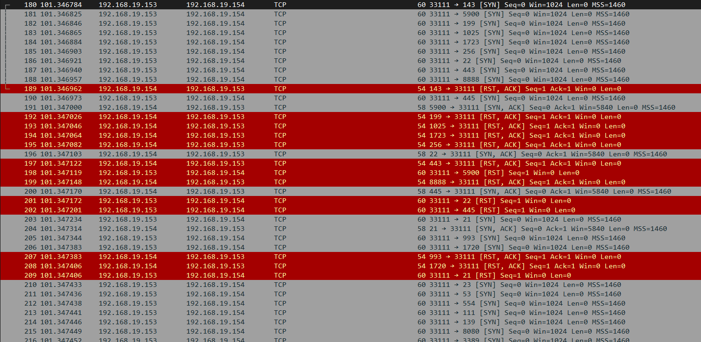
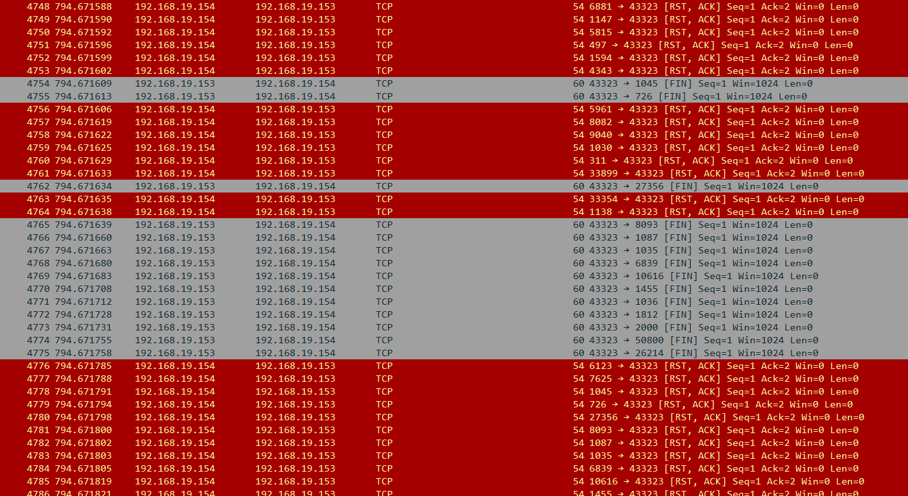
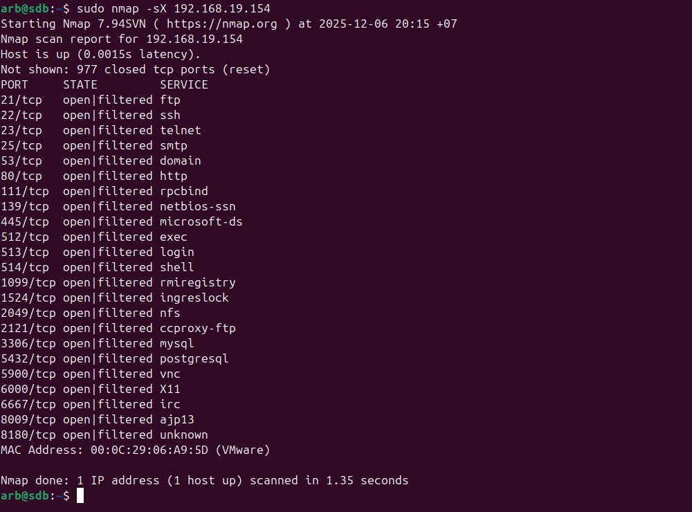
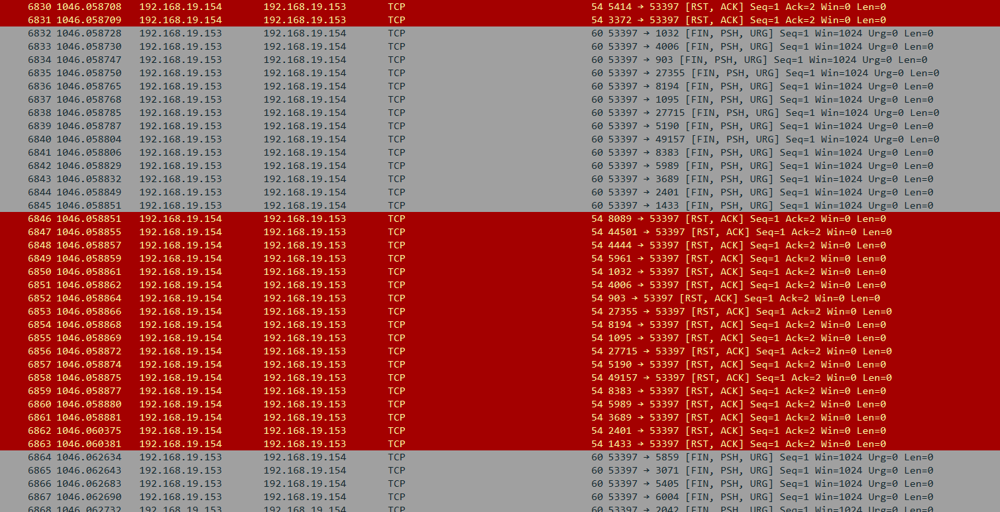
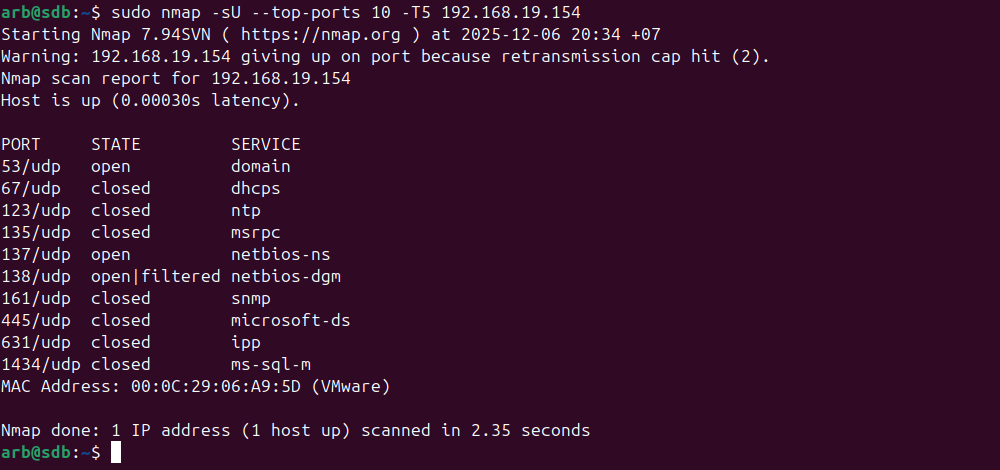
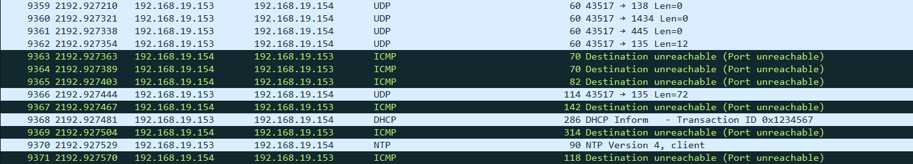

# **sdb_13_1_arb**

## Задание_1

Скачайте и установите виртуальную машину Metasploitable: https://sourceforge.net/projects/metasploitable/.
Это типовая ОС для экспериментов в области информационной безопасности, с которой следует начать при анализе уязвимостей.

Просканируйте эту виртуальную машину, используя nmap.
Попробуйте найти уязвимости, которым подвержена эта виртуальная машина.
Сами уязвимости можно поискать на сайте https://www.exploit-db.com/.

Для этого нужно в поиске ввести название сетевой службы, обнаруженной на атакуемой машине, и выбрать подходящие по версии уязвимости.

Ответьте на следующие вопросы:

- Какие сетевые службы в ней разрешены?
- Какие уязвимости были вами обнаружены? (список со ссылками: достаточно трёх уязвимостей)

Приведите ответ в свободной форме.

## Решение_1

ВМ Metasploitable установлена, смотрим какие порты и сервисы разрешены:

Список уязвимостей:

1. vsftpd 2.3.4: [Backdoor Command Execution (Metasploit)](https://www.exploit-db.com/exploits/17491)
2. UnrealIRCd 3.2.8.1: [Backdoor Command Execution (Metasploit)](https://www.exploit-db.com/exploits/16922)
3. PostgreSQL 8.3.6: [Conversion Encoding Remote Denial of Service](https://www.exploit-db.com/exploits/32849)

## Задание_2

Проведите сканирование Metasploitable в режимах SYN, FIN, Xmas, UDP.

Запишите сеансы сканирования в Wireshark.

Ответьте на следующие вопросы:

- Чем отличаются эти режимы сканирования с точки зрения сетевого трафика?
- Как отвечает сервер?

Приведите ответ в свободной форме.

## Решение_2

- Режим SYN.

Механизм:

- Nmap отправляет SYN-пакет на целевой порт
- Если порт открыт → цель отвечает SYN-ACK
- Nmap не завершает рукопожатие (не отправляет ACK)
- Вместо этого отправляет RST-пакет для разрыва

- Режим FIN.

Механизм:

- Nmap отправляет TCP-пакет с установленным флагом FIN (без предварительного SYN)
- Если порт закрыт → система отвечает RST-пакетом
- Если порт открыт → большинство систем игнорируют FIN-пакет (нет ответа)
- Отсутствие ответа трактуется как открытый/фильтруемый порт

- Режим Xmas.

Механизм:

- Отправляется TCP-пакет с флагами FIN, URG и PSH
- Закрытый порт → отвечает RST-пакетом
- Открытый порт → игнорирует (RFC 793) → нет ответа
- Фильтруемый порт → нет ответа или ICMP ошибка

- Режим UDP.

Механизм:

- Отправляется пустой UDP-пакет на целевой порт
- Если порт закрыт → получаем ICMP Port Unreachable (тип 3, код 3)
- Если порт открыт → служба может ответить (но часто игнорирует)
- Если нет ответа → состояние "open/filtered"

