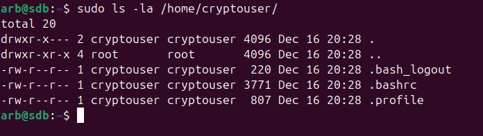
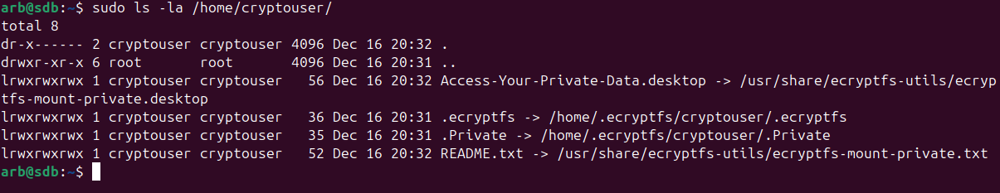
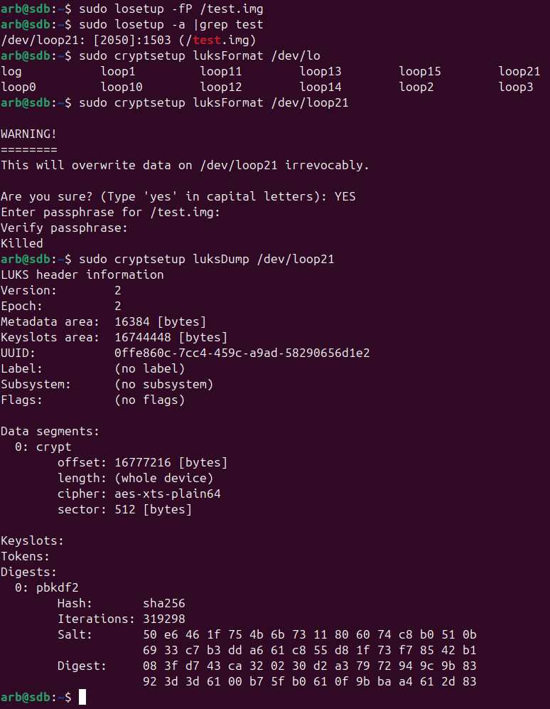

# **sdb_13_2_arb**

## Задание_1

- Установить eCryptfs.
- Добавить пользователя cryptouser.
- Зашифровать домашний каталог пользователя с помощью eCryptfs.

В качестве ответа снимки экрана домашнего каталога пользователя с исходными и зашифрованными данными.

## Решение_1

Устанавливаем, добавляем пользователя:

```
sudo apt install ecryptfs-utils -y
sudo adduser cryptouser
```
Домашний каталог:



Шифруем:

```
sudo ecryptfs-migrate-home -u cryptouser
```
Смотрим:




## Задание_2

- Установите поддержку LUKS.
- Создайте небольшой раздел, например, 100 Мб.
- Зашифруйте созданный раздел с помощью LUKS.

В качестве ответа пришлите снимки экрана с поэтапным выполнением задания.

## Решение_2

Установка:

```
sudo apt install cryptsetup -y
```

Процесс шифрования:
```
# Создание файла-контейнера
sudo dd if=/dev/zero of=/test.img bs=1M count=100

# Создание loop устройства
sudo losetup -fP /test.img

# Шифрование
sudo cryptsetup luksFormat /dev/loop21
```



