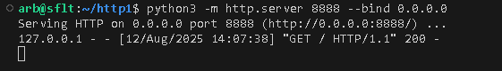
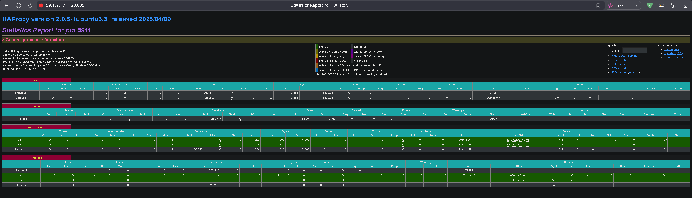
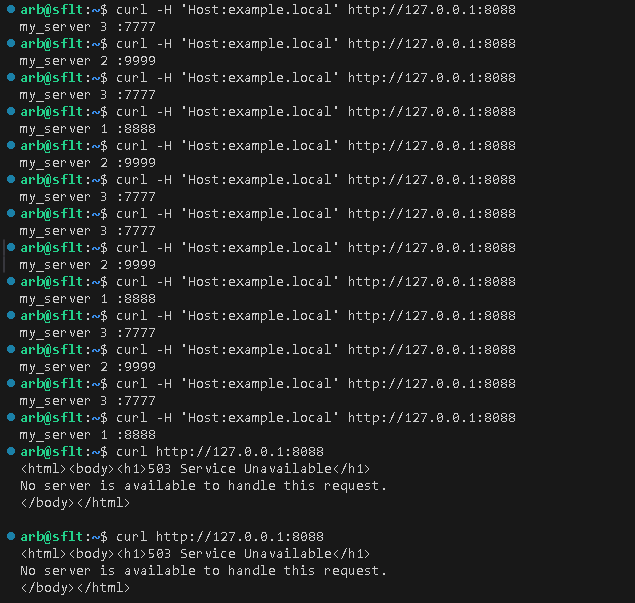
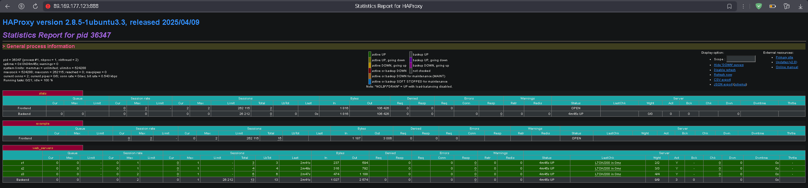

# **ДЗ_2_sflt_arb**


## Задание 1

Что нужно сделать:

1. Запустите два simple python сервера на своей виртуальной машине на разных портах.
2. Установите и настройте HAProxy, воспользуйтесь материалами к лекции по [ссылке](https://github.com/netology-code/sflt-homeworks/blob/main/2)
3. Настройте балансировку Round-robin на 4 уровне.

На проверку направьте конфигурационный файл haproxy, скриншоты, где видно перенаправление запросов на разные серверы при обращении к HAProxy.

## Решение 1

Запускаем и проверяем два simple python сервера на портах 8888 и 9999:




Устанавливаем, настраиваем и перезапускаепм HAProxy:
```
sudo apt install haproxy
sudo nano /etc/haproxy/haproxy.cfg 
sudo systemctl reload haproxy.service
```
Конфигурационный файл /etc/haproxy/[haproxy.cfg](./arch/haproxy-1.cfg)

Проверяем работу:


Смотрим статистику:




## Задание 2

Что нужно сделать:

1. Запустите три simple python сервера на своей виртуальной машине на разных портах.
2. Настройте балансировку Weighted Round Robin на 7 уровне, чтобы первый сервер имел вес 2, второй - 3, а третий - 4.
3. HAproxy должен балансировать только тот http-трафик, который адресован домену example.local

На проверку направьте конфигурационный файл haproxy, скриншоты, где видно перенаправление запросов на разные серверы при обращении к HAProxy c использованием домена example.local и без него.

## Решение 2

Запускаем еще один simple python сервер на порту 7777:


Меняем конфигурацию /etc/haproxy/haproxy.cfg.

Конфигурационный файл /etc/haproxy/[haproxy.cfg](./arch/haproxy-2.cfg)

Перезапускаем HAProxy и проверяем:



Смотрим статистику:

