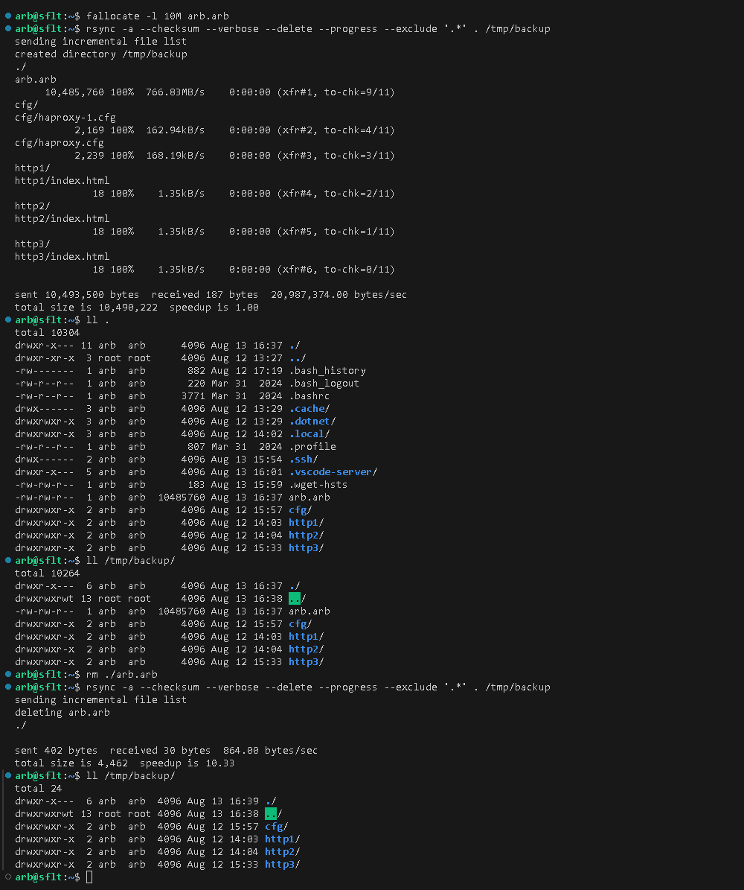
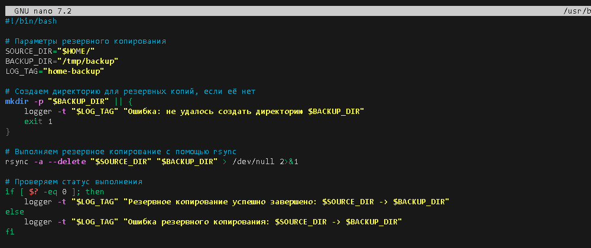
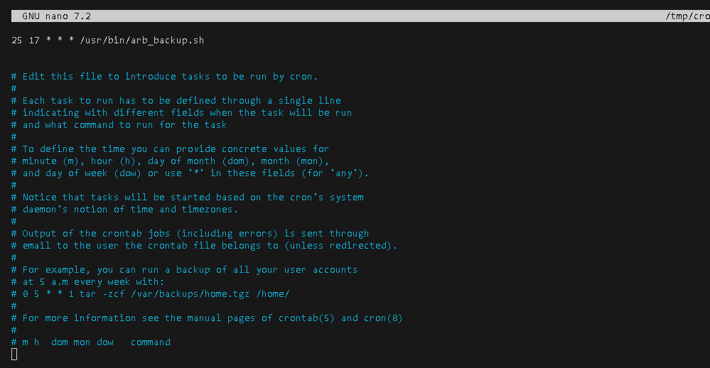

# **ДЗ_3_sflt_arb**


## Задание 1

Что нужно сделать:

1. Составьте команду rsync, которая позволяет создавать зеркальную копию домашней директории пользователя в директорию /tmp/backup
2. Необходимо исключить из синхронизации все директории, начинающиеся с точки (скрытые)
3. Необходимо сделать так, чтобы rsync подсчитывал хэш-суммы для всех файлов, даже если их время модификации и размер идентичны в источнике и приемнике

На проверку направить скриншот с командой и результатом ее выполнения.

## Решение 1

Команда rsync будет такая:
```
rsync -a --checksum --verbose --delete --progress --exclude '.*' . /tmp/backup
```

Предварительно создадим файл в домашнем каталоге, синхронизируем, посмотрим, удалим, еще раз синхронизируем и посмотрим, что получилось:




## Задание 2

Что нужно сделать:

1. Написать скрипт и настроить задачу на регулярное резервное копирование домашней директории пользователя с помощью rsync и cron.
2. Резервная копия должна быть полностью зеркальной.
3. Резервная копия должна создаваться раз в день, в системном логе должна появляться запись об успешном или неуспешном выполнении операции.
4. Резервная копия размещается локально, в директории /tmp/backup

На проверку направить файл crontab и скриншот с результатом работы утилиты.

## Решение 2

Создадим файл /usr/bin/arb_backup.sh со следующим содержимым:



Делаем файл исполняемым:
```
sudo chmod +x /usr/bin/arb_backup.s
```

Настраиваем задачу в cron (файл [crontab](./arch/arb)):
```
crontab -e
```


Ждем и смотрм логи:

